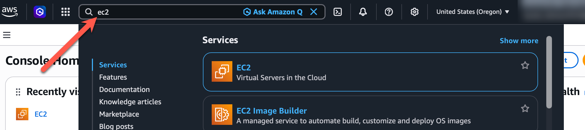
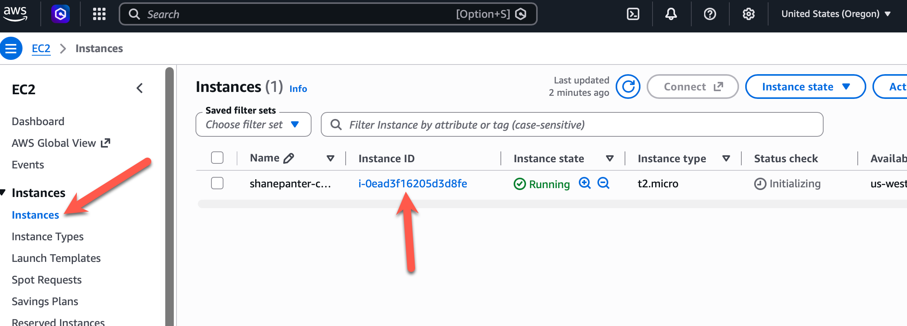
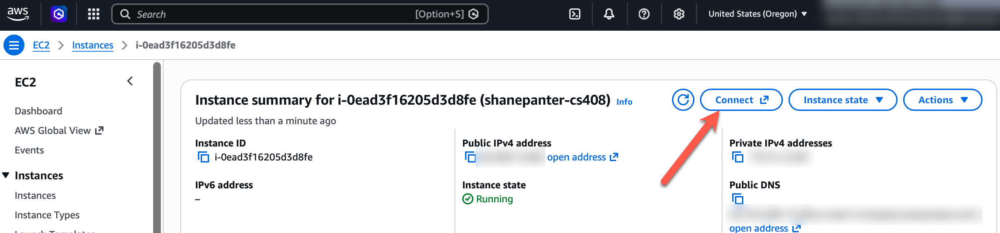
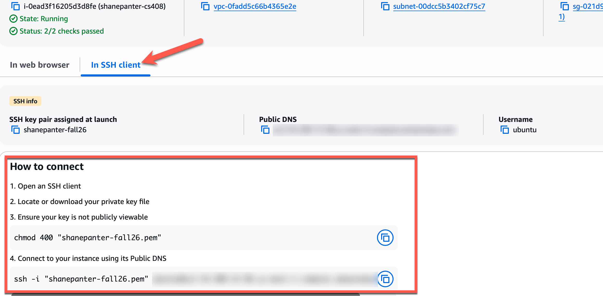
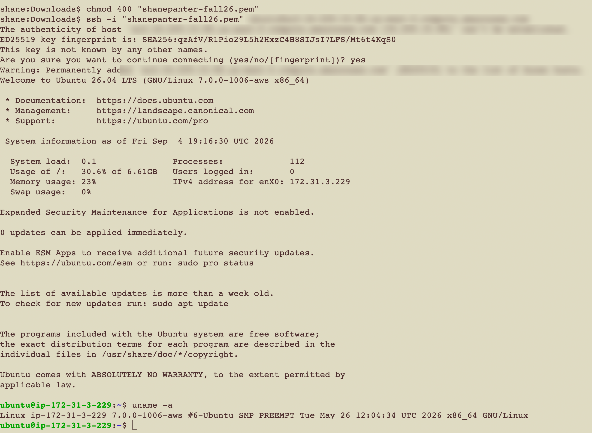

# 07.01 - Setup

**Week 7 · 50 points**

## Overview

This assignment is a simple assignment to confirm you can access your sandbox AWS account and create
an EC2 VM. In the AWS console you will see a lot of **Access Denied** for certain features. That is
fine and expected due to the limitations on the student account. You can access everything that is
needed for this class.

Example app: <https://github.com/shanep/simple-full-stack>

NOTE: Your AWS account should be activated by the time you start on this assignment, if it is not
please email me ASAP :)

## Tasks

### Task 1 - AWS Log in

- Instructions for how to get your AWS account:
  <https://docs.google.com/document/d/13fxRl74VXFLauW7WmduWOadu2FO6c5JrGtohanua0wI/edit?usp=sharing>
- You will login with your Boise State credentials to access AWS Innovation Sandbox
- You will have to click through a few screens to log in, eventually you should see the AWS
  console.
- **IMPORTANT**: In the final screenshot make sure you are in United States (Oregon) or
  **us-west-2**. Your account will NOT work in any other region!

## Task 2 - Launch a VM with EC2

- In the Search bar shown below in the console screenshot, search for EC2

- Create a new EC2 instance as follows:
  - Click the big orange "Launch Instance" button shown on the EC2 dashboard
  - Name the server as follows yourname-cs408
  - Select **Ubuntu** from the Quick Start Application and OS Images, then choose **Ubuntu Server
    24.04 LTS** in the Amazon Machine Image (AMI) list. The example app's scripts are tested on it,
    and its login user is `ubuntu`, which the later assignments use. (You may choose a different
    Linux distribution, but then you will have to adapt the scripts and the login user yourself.)
  - Keep the default Architecture, **64-bit (x86)**
  - Set the Instance type to **t2.micro**
  - Create a new Key Pair (login) with key pair type **RSA** and private key file format **.pem**
    (not .ppk). Save the downloaded key in a safe place, because you will need it to ssh into your
    machine (just like you do on onyx)
    - This should download a key to your downloads folder which you will use later.
  - In the **Network Settings** section make sure and click **create a new default VPC** if there is
    a warning banner displayed
  - Make sure and check the boxes for the following:
    - Allow SSH traffic from
    - Allow HTTPS traffic from the internet (nothing uses HTTPS yet; this is for later)
    - Allow HTTP traffic from the internet
  - Keep all other setting as default.
  - Launch the instance and wait for it to come online
- Access your EC2 server via SSH
  - In the left navigation on the AWS console click **Instances** and you should see your new
    instance with an instance state of "Running". If it doesn't say "Running" give a few minutes to
    fully come online.

- - Click on the link in the Instance ID column
  - Then click on the "Connect" link as show below

- - Click on the **In SSH client** tab to get the instructions to ssh into your machine

- - Now open a terminal and go to the folder where you saved your key.
  - **Lock down the key first**, or ssh refuses to use it with an "UNPROTECTED PRIVATE KEY FILE"
    error: `chmod 400 yourkey.pem` (use your key's file name). You only need to do this once. On
    Windows, run this in WSL or Git Bash.
  - Then connect with the `ssh` command shown on the **SSH client** tab. It looks like
    `ssh -i yourkey.pem ubuntu@<your public DNS or IP>`.
  - Type **yes** when it asks you if you are sure you want to connect. Don't worry it is safe!
  - Run uname -a to confirm you are on your server!

**Congrats!** If you made it this far you have your own virtual machine on AWS to run your web app
on. Your terminal should look like the screenshot below: the `ubuntu@ip-...` prompt and the output
of `uname -a`. **Take this screenshot now; it is what you submit.**

**Stopping your instance changes its public IP address**; rebooting does not. If you stop it (for
example to save credits) and start it again, your site moves to a new address, so update the
spreadsheet with the new IP.

## Task 3 - GitHub and the class spreadsheet

- Create a GitHub repository to host your application code. **It must be public**: I grade every
  checkpoint by cloning it, and if I cannot clone it, that checkpoint's own work earns 0.
- Before your first commit, add a `.gitignore` that excludes `*.pem` and `.env`, so your AWS key and
  any passwords can never be committed. The example app's `.gitignore` is a good starting point.
- Update the
  [spreadsheet](https://docs.google.com/spreadsheets/d/1i7Q7-9iB72qxAtYEWuGTd-AL_2OAXnVBtsiBRLfutE0/edit?usp=sharing)
  with your **name** and your **GitHub repository URL**. You add your public IP address in 07.02.

## Submitting

Upload the screenshot from Task 2. Each item below is either done or not done, and earns all of its
points or none:

| Item | Done when | Points |
|----|----|----|
| **Task 2: Connected to your server** | The screenshot shows the `ubuntu@ip-...` prompt of your EC2 server, which proves you logged in to AWS (Task 1), launched the VM, and connected with your key. | 20 |
| **Task 2: uname -a on the server** | The screenshot shows the output of `uname -a`, run on the server. | 5 |
| **Task 3: Spreadsheet row** | Your row in the class spreadsheet has your name and your GitHub repository URL. | 5 |
| **Task 3: Repository is public** | The repository URL in the spreadsheet opens without logging in to GitHub. | 10 |
| **Task 3: .gitignore protects secrets** | The repository has a `.gitignore` that excludes `*.pem` and `.env`. | 10 |
|  | **Total** | **50** |

## Rubric

| n | description | points |
| --- | --- | --- |
| 1 | Task 2: Connected to your server: The screenshot shows the ubuntu@ip-... prompt of your EC2 server, which proves you logged in to AWS (Task 1), launched the VM, and connected with your key. | 20 |
| 2 | Task 2: uname -a on the server: The screenshot shows the output of uname -a, run on the server. | 5 |
| 3 | Task 3: Spreadsheet row: Your row in the class spreadsheet has your name and your GitHub repository URL. | 5 |
| 4 | Task 3: Repository is public: The repository URL in the spreadsheet opens without logging in to GitHub. | 10 |
| 5 | Task 3: .gitignore protects secrets: The repository has a .gitignore that excludes *.pem and .env. | 10 |
