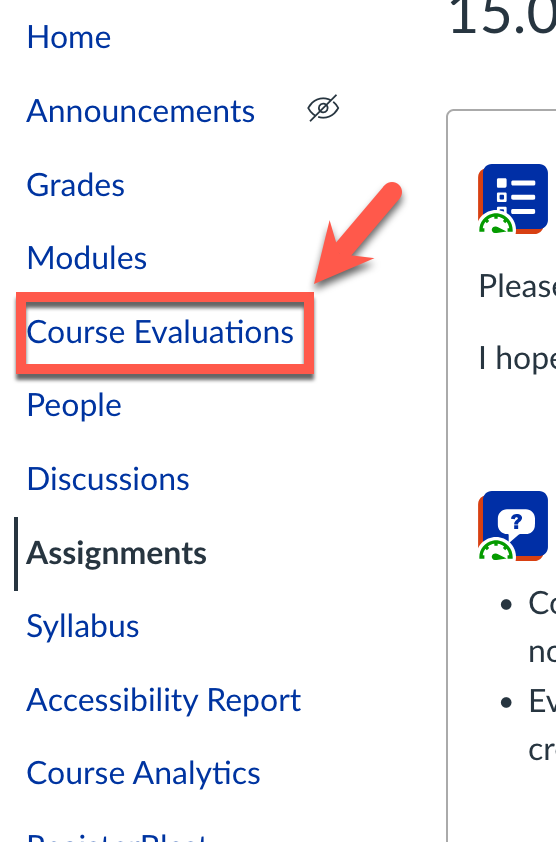

# 16.02 End of Semester Student Evaluation (15 min)

**Week 15 · 10 points**

## Instructions

 Please complete the Course Evaluations.  I hope that you learned a lot in this class and enjoyed
your time. :)

## Why Are We Doing This?

- Course evaluations help me and the computer science department understand what works well and what
  doesn't. We use the evaluation results to help us improve future offerings of not only this course
  but other courses in the department as well.
- Evaluations are anonymous, so I cannot see who has completed the assessment. Therefore, if you
  don't submit something to Canvas via this assignment, I will have no way of giving you credit.

## Submission & Grading

- To get credit for this assignment, you can:
  - upload a screenshot of your evaluation receipt; OR
  - Type "DONE" in the text entry box below this assignment
- Completing this assignment will earn you 10 points.
