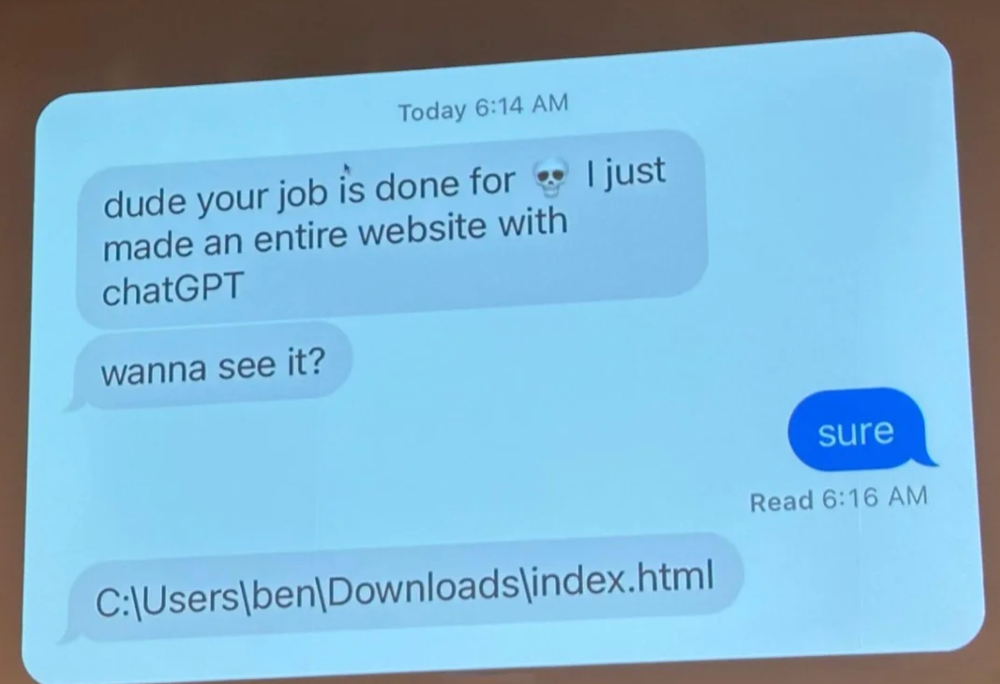

# 01.04 AI, Web Development, and Job Security

**Week 1 · 25 points · due Fri Aug 28, 11:59 PM**

## AI, Web Development, and Job Security

Look at the meme below where someone proudly claims they built an "entire website with ChatGPT"—only
to share a local file path (C:\Users\ben\Downloads\index.html) instead of a live, deployable site.

## In the discussion forum below answer the following questions

- Why is this meme funny?
- Think about the difference between having a single HTML file on your computer versus actually
  building, deploying, and maintaining a real, functional website.
- Consider what’s missing (hosting, databases, authentication, scalability, frontend frameworks,
  etc.).
- Why isn’t AI going to take your job (at least not completely)?
- Discuss the limits of AI-generated code.
- What unique skills do full-stack developers bring that AI cannot fully replace (yet)?
- Consider debugging, architecture design, integrating complex systems, security, and collaborating
  with teams.

## Submitting

- Post your response (150–200 words).
- Be sure to reference both the joke in the meme and the real-world differences between AI code
  generation and professional full-stack development.
- After posting, reply to at least two classmates with thoughtful comments that extend the
  discussion (e.g., agree/disagree with their perspective, add another example, or ask a follow-up
  question).
