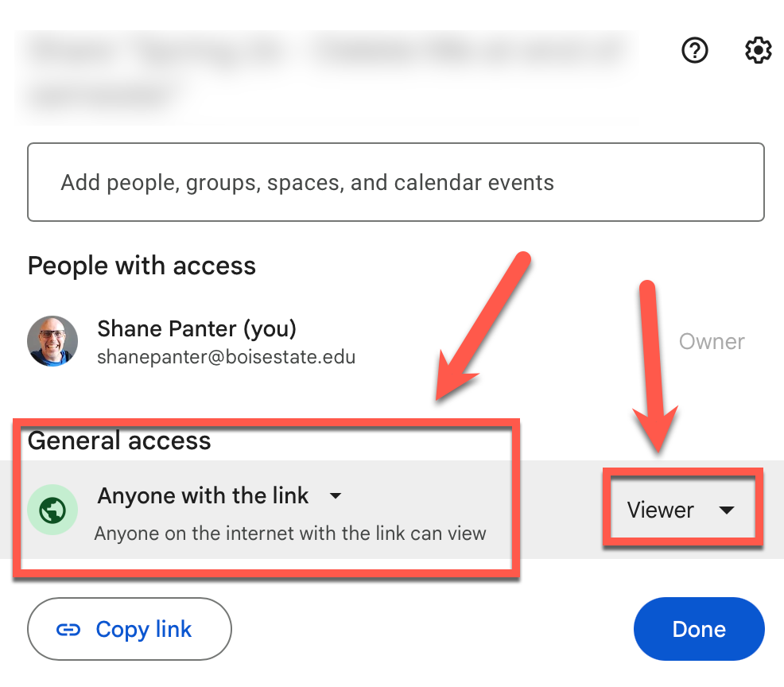

# 06.01 Project Specification Peer Review

**Week 6 · 100 points**

## Overview

In this discussion, you will review project specifications from other students to help them improve
their plan. The goal is to give constructive, specific feedback that helps your peer produce a
stronger, more complete proposal before they begin development. Please focus on the technical merits
of the proposal, not the subject matter.

### Task 1: Post your Spec Doc

Create a new post in this discussion forum with a link to your Google document. Make sure to set the
General access to "Anyone with the link (viewer)" as shown below, so other students can access it.

### Task 2: Review two other students

After carefully reading the specification you are reviewing, reply to that student's post with the
following sections. Use the headings provided so your review is easy to follow. Rate each
of the following 12 criteria on a 3-point scale: Strong (3), Adequate (2), or Needs Work (1).
Present your ratings in a simple table or formatted list. For any item rated “Needs Work,” include a
brief explanation of what’s missing.

|  |  |  |
|----|----|----|
| 1 | **Overview & Theme** | Is the project concept clear? Could you explain it to someone else? |
| 2 | **Target Audience** | Is a specific audience identified with a clear use case? |
| 3 | **Functionality** | Are concrete features described that cover CRUD, forms, and conditional data retrieval? |
| 4 | **Database Schema** | Is there a schema that matches the described functionality? |
| 5 | **Tech Stack Details** | Are backend/frontend technologies, frameworks, and EC2 scripts all specified? |
| 6 | **Media Plan** | Does it say what media is needed and where it comes from? |
| 7 | **Wireframes** | Is there a wireframe for every page showing layout, navigation, and key elements? |
| 8 | **Schedule / Checkpoints** | Are there 7 concrete, assessable checkpoints with clear deliverables? |
| 9 | **Testing Strategy** | Is there a plan for automated testing? |
| 10 | **Install & Run Instructions** | Could you set up the app on a fresh EC2 instance using these instructions? |
| 11 | **Writing Quality** | Is the document professional, organized, and at least 900 words? |
| 12 | **Feasibility & Scope** | Is the project realistic for 8 weeks while still meeting all minimum requirements? Is the scope too small?  |

### Written Feedback

Answer each of the following questions in 2-3 sentences minimum. Be specific about exact sections,
wireframes, schema fields, or checkpoints from the proposal.

1. What is the strongest aspect of this proposal? Why does it stand out?
2. Is anything unclear or missing? What additional details would help you understand the project?
3. Do the wireframes give a clear picture of the application’s layout and user flow? What could be
    improved?
4. Does the database schema support the described functionality? Are there missing or unnecessary
    tables/fields?
5. Are the 7 checkpoints realistic, specific, and assessable? Which ones need more detail?
6. Does the proposal address every minimum requirement (landing page, pages, forms, CRUD,
    conditional retrieval, CSS styling, EC2 scripts)? List any that are missing or unclear.
7. Is the project scope appropriate, neither too ambitious nor too trivial, for the 8-week
    timeline?
8. What is one specific, actionable suggestion to strengthen this proposal?

### Summary

End your review with one of the following overall assessments and a one-sentence justification:

- ✅ Ready to Build - The proposal is complete, and the author can begin development.
- ⚠️ Needs Revision - The proposal has gaps that should be addressed before development begins.
- ❌ Major Revision Required - Significant sections are missing or the scope/feasibility needs
  rethinking.

### Submission

You are finished when you have done the following:

1. Posted your project spec to **be reviewed**
2. Reviewed TWO other students according to the criteria above.
3. Refer to the [Grading
    Rubric](https://community.instructure.com/en/kb/articles/661285-how-do-i-view-the-rubric-for-my-graded-discussion)
    for grading details

## Rubric

| n | description | points |
| --- | --- | --- |
| 1 | Peer review #1 | 50 |
| 2 | Peer review #2 | 50 |
