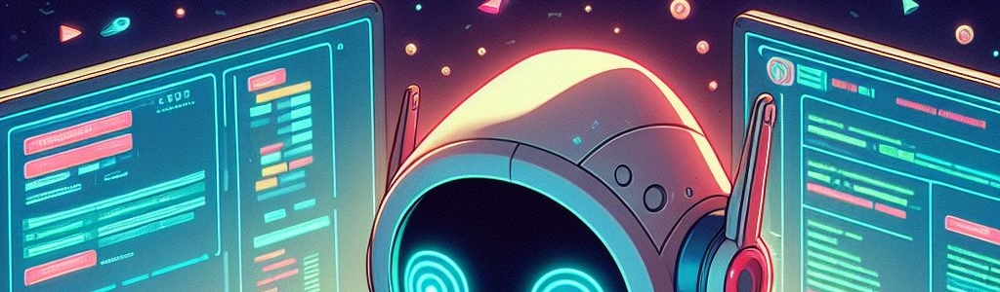

# Home Page

## Welcome to CS408 - Full Stack Web Development

### Getting Started

1. Review the items in the Course Navigation Menu on the left side of the screen. This navigation
    menu is available as you work through the course.
2. Click **Syllabus** to review the course syllabus and schedule.
3. Click **Modules** when you are ready to access the course content and activities.
