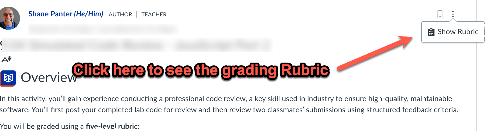
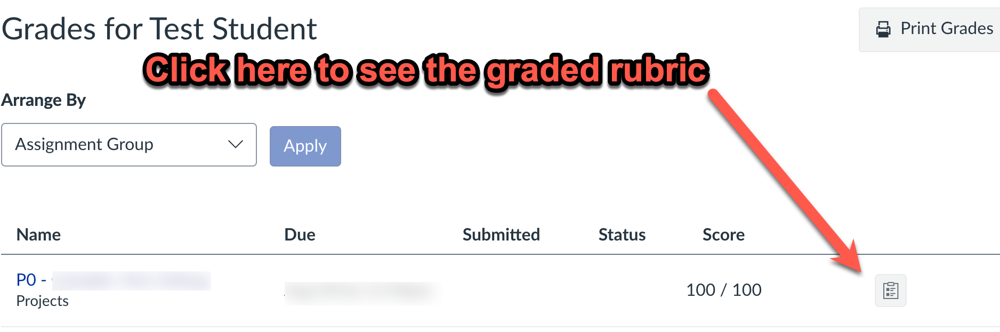

# 01.01 README - Introduction

## Course Introduction

Hello! My name is Shane Panter, and I will be your instructor for this class. In this class, we will
continue where CS208 left off, learning about full-stack web development. We will start the first
part of this course with a review of CS208 material. We will then spend the rest of the semester
building a full-stack website of your design and hosting it on AWS.

### Project

During the semester, you will design, build, and deploy a website of your design. This class is
designed to give you complete flexibility and control over choosing the languages, frameworks, and
other technologies to build your website. The only requirement is that you must have a method to
make your website available on the public internet. I will provide you with an AWS login, which you
can use to spin up your own virtual machine in the cloud.

### Using Rubrics

For the remainder of the semester, we use **rubrics in Canvas** to make grading transparent,
consistent, and aligned with the learning goals for each assignment. Rubrics describe precisely
**what is expected** for full credit and how each part of your work will be evaluated.

### Rubrics in Canvas Discussions

For discussion-based assignments (like the **Final Project Checkpoints**), the rubric is attached
directly to the discussion page.

**To access the rubric:**

1. Go to the **Discussion** for the assignment.

2. On the right-hand side (or below the prompt, depending on your view), click **Show Rubric**
    (see the screenshot below).

3. Review the criteria before you start. It shows how each part of the assignment will be graded.

4. After you’ve submitted your post or reviews, you can return to the same place to **see
    instructor feedback and scores** for each rubric category.

---

## How to View the Rubric and Feedback in the Gradebook

After your instructor has graded your discussion or assignment, you can view your **rubric scores
and comments** directly from the **Canvas Gradebook**.

### To view the rubric in the Gradebook

1. **Open Canvas** and click on the **“Grades”** link in the course navigation menu.

2. Locate the assignment in your list of graded items.

3. Click the **assignment title** or the **rubric icon** next to your score.

    - This will open the **Submission Details** or **Gradebook feedback panel**

4. The screenshot below shows you how to access the rubric.

