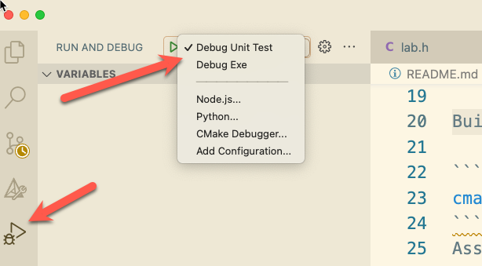

# Project 1


## Overview

This project is intended to serve as an introduction to the project template,
build tools, and process to complete projects during this semester. This project
demonstrates the only **officially** supported tools and programming languages.

We are going to review the following topics:

1. How to setup your project with the provided starter code
2. How to use the build system
3. How to write unit tests
4. Demonstrate address sanitizer output
5. How to use the debugger
6. Submitting the project with a submission report

## Learning Outcomes

- 5.1 Compile your code with a build system
- 5.2 Use a unit test framework
- 5.3 Use a professional version control system (git)
- 5.4 Explore compiling and running code on at least 2 different systems (Codespaces and Onyx)
- 5.5 Explore how to setup a continuous integration and testing project

## Grading Rubric

Make sure and review the class [grading rubric](grading-rubric.md) so you know how your project will
be graded.

<!--@include: ../../../parts/project-setup-boiler.md -->


## Task 2 - Prepare your repository

The starter repository is a bare bones template that you will need to update with the starter code
below. Replace the contents of each file with the code shown.

### src/lab.h

<<< @/cs452/code/p1/lab.h{c}

### src/lab.c

<<< @/cs452/code/p1/lab.c

### src/main.c

<<< @/cs452/code/p1/main.c

### tests/lab-test.c

<<< @/cs452/code/p1/test-lab.c

Once you have updated all the starter code let's make your first commit so everything is saved.
Open up a terminal and let's make a commit!

```bash
git add --all
git commit -m "Added in starter code"
git push
```

## Task 3 - Compile

You can compile the project by typing `make all` in the terminal. This builds all four versions of
the project. For now we only care about the debug version, `build/debug/myapp_d`, which is compiled
with [Address Sanitizer](https://clang.llvm.org/docs/AddressSanitizer.html) turned on. Once you have
successfully compiled the project you can run the executable like this (the output below has been
trimmed):

```bash
@BSU-ShanePanter ➜ /workspaces/cs452-p1 (master) $ make all
...
Builds completed. You can run the application with: ./build/release/myapp
You can run the debug build with: ./build/debug/myapp_d
You can run the test build with: ./build/tests/myapp_t
You can run the debug-test build with: ./build/debug-test/myapp_td
@BSU-ShanePanter ➜ /workspaces/cs452-p1 (master) $ ./build/debug/myapp_d
What is your name? shane
Hello shane! This is the starter template version: 1.0

=================================================================
==8990==ERROR: LeakSanitizer: detected memory leaks

Direct leak of 120 byte(s) in 1 object(s) allocated from:
    #0 0x7f0014924808 in malloc
    #1 0x7f00145f1c2a in getdelim
    #2 0x5646c7cd6660 in main src/main.c:18

Direct leak of 10 byte(s) in 1 object(s) allocated from:
    #0 0x7f0014924808 in malloc
    #1 0x5646c7cd62be in getVersion src/lab.c:8
    #2 0x5646c7cd65f1 in main src/main.c:16

SUMMARY: AddressSanitizer: 130 byte(s) leaked in 2 allocation(s).
```

Well that is not good! We have a memory leak in the starter code that we need to fix. Address
Sanitizer tells us exactly where the leaked memory was allocated: `getline` allocated a buffer for
`line` on line 18 of `src/main.c`, and `getVersion` allocated the `version` string. Open up the file
`src/main.c` and free the `line` and `version` variables after the last printf call.

```c
free(line);
free(version);
```

Now compile and run the program again to see the fix. You only need the debug build, so you can run
`make debug` instead of `make all`.

```bash
@BSU-ShanePanter ➜ /workspaces/cs452-p1 (master) $ make debug
make BUILD=debug
make[1]: Entering directory '/workspaces/cs452-p1'
mkdir -p build/debug
cc -g -O0 -DDEBUG -fno-omit-frame-pointer -fsanitize=address -c src/main.c -o build/debug/main.c.o
cc -g -O0 -DDEBUG -fno-omit-frame-pointer -fsanitize=address build/debug/lab.c.o build/debug/main.c.o -o build/debug/myapp_d -fsanitize=address
make[1]: Leaving directory '/workspaces/cs452-p1'
@BSU-ShanePanter ➜ /workspaces/cs452-p1 (master) $ ./build/debug/myapp_d
What is your name? shane
Hello shane! This is the starter template version: 1.0
```

Let's commit our work so far.

```bash
git add src/main.c
git commit -m "Fixed leak in main.c"
git push
```

So far so good. We now have a working executable that is bug free. Let's move on to the tests.

## Task 4 - Test

The starter template is setup with the [Unity](https://github.com/ThrowTheSwitch/Unity) test harness
that will make it easy to write and run tests. There are two ways to run the tests.

- `make check` runs `build/tests/myapp_t`, which is compiled to measure code coverage
- `make leak-test` runs `build/debug-test/myapp_td`, which is compiled with Address Sanitizer

Both of them run the tests that are already built, so run `make all` first. Let's start with
`make check`.

```bash
@BSU-ShanePanter ➜ /workspaces/cs452-p1 (master) $ make check
tests/lab-test.c:28:test_leak:PASS
/bin/bash: line 1: 9120 Segmentation fault      ./build/tests/myapp_t
make: *** [Makefile:125: check] Error 139
```

The tests crashed before they could finish. Fix the crash, then run `make all` and `make check`
again. The tests may all pass now, but don't celebrate yet! The coverage build can't see most memory
errors, so now run the same tests with Address Sanitizer. The output below has been trimmed.

```bash
@BSU-ShanePanter ➜ /workspaces/cs452-p1 (master) $ make leak-test
tests/lab-test.c:28:test_leak:PASS
tests/lab-test.c:29:test_segfault:PASS
=================================================================
==9245==ERROR: AddressSanitizer: stack-buffer-overflow on address 0x7ffd4e2b1a54 at pc 0x55f3c1a2b4f1 bp 0x7ffd4e2b1a10 sp 0x7ffd4e2b1a08
WRITE of size 4 at 0x7ffd4e2b1a54 thread T0
    #0 0x55f3c1a2b4f0 in outOfBounds src/lab.c:27
    #1 0x55f3c1a2c9a1 in test_bounds tests/lab-test.c:23
...
SUMMARY: AddressSanitizer: stack-buffer-overflow src/lab.c:27 in outOfBounds
```

This approach will allow us to write high quality code and catch bugs early so when we are working
on larger projects we can focus on the project requirements instead of the low level details of
memory errors. Address Sanitizer can detect the following types of bugs:

- Out-of-bounds accesses to heap, stack and globals
- Use-after-free
- Use-after-return (enable at runtime with `ASAN_OPTIONS=detect_stack_use_after_return=1`)
- Use-after-scope
- Double-free, invalid free
- Memory leaks (Linux only)

You need to fix all the issues in the project before proceeding to the next task. There should be no
build warnings, no disabled tests, and both `make check` and `make leak-test` should pass with no
Address Sanitizer errors.

::: info

This is just a warm-up project. The functions that are failing can be fixed in any number of ways. I
am not looking for any specific fix, I am just looking for you to make the tests pass instead.

:::

Fix all the tests in the file `tests/lab-test.c` to pass just like we did in the previous step. Once
you have all the tests passing make sure and do a `git add`, `git commit` and `git push` just
like the previous task.

Once you have fixed all the broken tests you should see a clean test run with all tests passing.

```bash
@BSU-ShanePanter ➜ /workspaces/cs452-p1 (master) $ make leak-test
tests/lab-test.c:28:test_leak:PASS
tests/lab-test.c:29:test_segfault:PASS
tests/lab-test.c:30:test_bounds:PASS

-----------------------
3 Tests 0 Failures 0 Ignored
OK
```

Finally, run `make report` to see how much of your code the tests cover. The summary is printed in
the terminal and a detailed report is saved in `build/report/html/coverage_report.html`.

## Task 5 - Run the debugger

This starter template should work out of the box for both unit tests and the executable. The
debugger runs the debug builds, so run `make all` first. Open the debugger view in VS Code and set a
breakpoint in the `main` function and a breakpoint in one of the functions in the `tests/lab-test.c`
file. Run the **Debug Exe** configuration and then the **Debug Tests** configuration and verify that
the debugger stops at the breakpoints. You will need to run the debugger separately for the unit
tests and the executable.



::: danger

While this task is not graded it is important that you are able to use the
debugger, so don't skip this task. Make sure you can use the debugger **now**
instead of at 11:45pm the night the project is due and there is no one around to
help you.

:::


<!--@include: ../../../parts/project-submit-boiler.md -->
