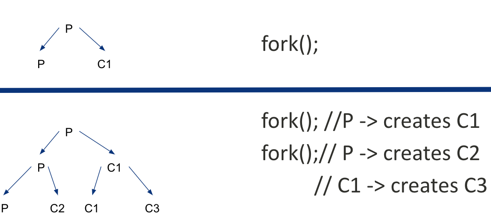

# Key Process API

-   fork()

-   wait()

-   exec()

-   kill()

-   pipe()

# Fork 🍴

-   creates a child process that is a clone of the parent

-   The child process differs from the parent process only in its
    process id and its parent process id

-   The fork() is called once but it returns twice!

## Process Hierarchy

<figure>

</figure>

## Exercise

On success, the PID of the child process is returned in the parent, and
0 is returned in the child. On failure, -1 is returned in the parent, no
child process is created, and errno is set to indicate the error.

    /* process A */
     /* ... */
     if ( fork () == 0) {
        if ( fork () == 0) {
            if ( fork () == 0) {
                if ( fork () == 0) {
                    /* do something */
                }
            }
        }
     }

How many new processes are created by the code snippet?

# Wait🚏

Sometimes, as it turns out, it is quite useful for a parent to wait for
a child process to finish what it has been doing. This task is
accomplished with the wait() system call (or its more complete sibling
waitpid()

# Exec

A final and important piece of the process creation API is the exec()
system call. This system call is useful when you want to run a program
that is different from the calling program

# Linux vs Windows

<table>
<colgroup>
<col style="width: 50%" />
<col style="width: 50%" />
</colgroup>
<tbody>
<tr class="odd">
<td style="text-align: left;">
Linux
</td>
<td style="text-align: left;">
Win32
</td>
</tr>
<tr class="even">
<td style="text-align: left;">
fork(), exec()
</td>
<td style="text-align: left;">
CreateProcess() (fork exec
combined)
</td>
</tr>
<tr class="odd">
<td style="text-align: left;">
exit()
</td>
<td style="text-align: left;">
ExitProcess()
</td>
</tr>
<tr class="even">
<td style="text-align: left;">
wait(), waitpid()
</td>
<td style="text-align: left;">
WaitForSingleObject(),
WaitForMultipleObjects()
</td>
</tr>
<tr class="odd">
<td style="text-align: left;">
kill()
</td>
<td style="text-align: left;">
TerminateProcess()
</td>
</tr>
</tbody>
</table>

# Signals

Linux/Unix signals are a type of event. Signals are asynchronous in
nature and are used to inform processes of certain events happening (man
7 signal).

## Examples

-   SIGINT

-   SIGCONT

-   SIGKILL

[Signals](https://man7.org/linux/man-pages/man7/signal.7.html)

# Questions?
