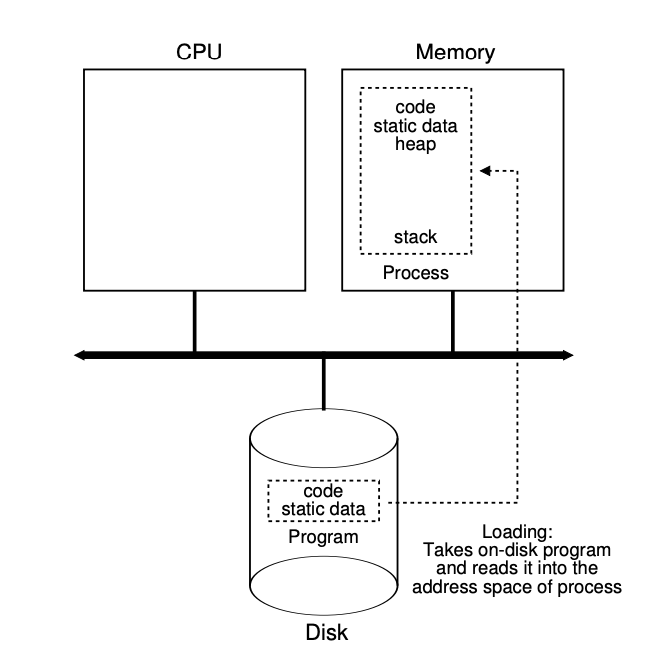

# What?

The process is one of the most fundamental abstractions that the OS
provides to users. A process is a running program.

-   Address space

-   Registers

    -   programming counter (PC)

    -   OR instruction pointer (IP)

-   Stack pointer

# Process API

-   Create

-   Destroy

-   Wait

-   Miscellaneous Control

-   Status

# Loading A process

<figure>

</figure>

# Process States

<figure>

</figure>

# Data Structures

A process is just a struct!

[Linux
Process](https://docs.huihoo.com/doxygen/linux/kernel/3.7/structtask__struct.html)

# Questions?
