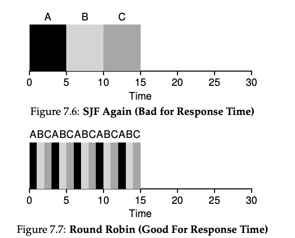

# Workload Assumptions

1.  Each job runs for the same amount of time.

2.  All jobs arrive at the same time.

3.  Once started, each job runs to completion.

4.  All jobs only use the CPU (i.e., they perform no I/O)

5.  The run-time of each job is known.

# Scheduling Metrics

-   *T**t**u**r**n**a**r**o**u**n**d* = *T**c**o**m**p**l**e**t**i**o**n* − *T**a**r**r**i**v**a**l*

-   Assume *T**a**r**r**i**v**a**l* = 0

-   Thus
    *T**t**u**r**n**a**r**o**u**n**d* = *T**c**o**m**p**l**e**t**i**o**n*

# First In, First Out (FIFO)

-   Most basic algorithm

-   Also know as First Come, First Served (FCFS)

-   Simple to implement

-   Not a great performer

## Perfect

<figure>

</figure>

$T\_{turnaround} = \frac{10+10+10}3 = 10$

## Bad Performance

<figure>

</figure>

$T\_{turnaround} = \frac{100+110+120}3 = 110$

# Shortest Job First (SJF)

<figure>

</figure>

$T\_{turnaround} = \frac{10+20+120}3 = 50$

# A New Metric: Response Time

-   *T**r**e**s**p**o**n**s**e* = *T**f**i**r**s**t**r**u**n* − *T**a**r**r**i**v**a**l*

## Details

<figure>

</figure>

# Round Robin

The basic idea is simple: instead of running jobs to completion, RR runs
a job for a time slice (sometimes called a scheduling quantum) and then
switches to the next job in the run queue

# Advanced Algorithms

All the algorithms discussed are fairly simple and modern operating
systems use more advanced data structures such as a multi-level feedback
queue to further improve performance!

# Questions
