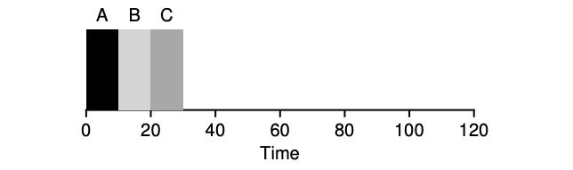

# Scheduling

## First In, First Out (FIFO)

- Most basic algorithm
- Also know as First Come, First Served (FCFS)
- Simple to implement
- Not a great performer

## Perfect

$T\_{turnaround} = \frac{10+10+10}3 = 10$

## Bad Performance

$T\_{turnaround} = \frac{100+110+120}3 = 110$

## Shortest Job First (SJF)

$T\_{turnaround} = \frac{10+20+120}3 = 50$

## Round Robin

The basic idea is simple: instead of running jobs to completion, RR runs
a job for a time slice (sometimes called a scheduling quantum) and then
switches to the next job in the run queue

## Advanced Algorithms

All the algorithms discussed are fairly simple and modern operating
systems use more advanced data structures such as a multi-level feedback
queue to further improve performance!
