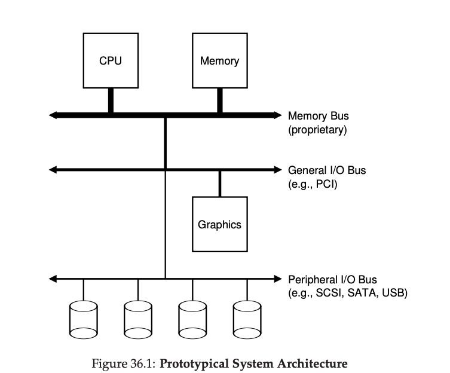
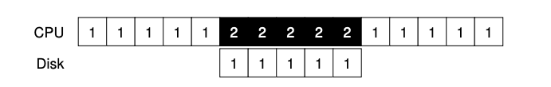
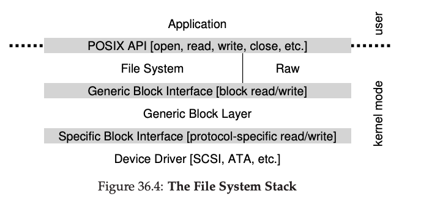

# General System Architecture

<figure>

</figure>

# Modern System (intel)

<figure>

</figure>

# A Canonical Device

<figure>

</figure>

## Protocols

-   Polling the device

-   Interrupts

## Polling

    While (STATUS == BUSY)
    ; // wait until device is not busy
    Write data to DATA register
    Write command to COMMAND register
    (starts the device and executes the command)
    While (STATUS == BUSY)
    ; // wait until device is done with your request

-   Issues with this approach?

## Interrupts

-   Instead of polling the device repeatedly, the OS can issue a
    request, put the calling process to sleep, and context switch to
    another task

-   When the device is finally finished with the operation, it will
    raise a hardware interrupt, causing the CPU to jump into the OS at a
    predetermined interrupt service routine (ISR) or more simply an
    interrupt handler.

## Example

<figure>

</figure>

<figure>

</figure>

# DMA

<figure>

</figure>

# Methods Of Device Interaction

-   Explicit I/O instructions -These instructions specify a way for the
    OS to send data to specific device registers and thus allow the
    construction of the protocols described above.

-   Memory mapped I/O. With this approach, the hardware makes device
    registers available as if they were memory locations. To access a
    particular register, the OS issues a load (to read) or store (to
    write) the address; the hardware then routes the load/store to the
    device instead of main memory.

# Fitting Into The OS: The Device Driver

<figure>

</figure>

# Questions?
