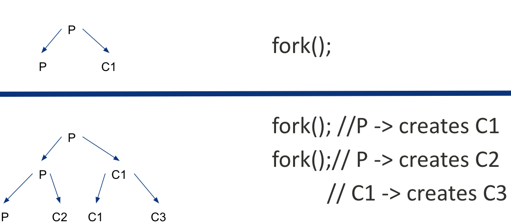

# Process API

<SlideView />

## Introduction

- fork()
- wait()
- exec()
- kill()
- pipe()

## Fork 🍴

- creates a child process that is a clone of the parent
- The child process differs from the parent process only in its process id and its parent process id
- The fork() is called once but it returns twice!

## Process Hierarchy



## Exercise

On success, the PID of the child process is returned in the parent, and
0 is returned in the child. On failure, -1 is returned in the parent, no
child process is created, and errno is set to indicate the error.

```c
/* process A */
/* ... */
if ( fork () == 0) {
   if ( fork () == 0) {
       if ( fork () == 0) {
           if ( fork () == 0) {
               /* do something */
           }
       }
   }
}
```

How many new processes are created by the code snippet?

## Wait🚏

Sometimes, as it turns out, it is quite useful for a parent to wait for
a child process to finish what it has been doing. This task is
accomplished with the wait() system call (or its more complete sibling
waitpid()

## Exec

A final and important piece of the process creation API is the exec()
system call. This system call is useful when you want to run a program
that is different from the calling program

## Linux vs Windows

| Linux             | Win32                                           |
|-------------------|-------------------------------------------------|
| fork(), exec()    | CreateProcess() (fork exec combined)            |
| exit()            | ExitProcess()                                   |
| wait(), waitpid() | WaitForSingleObject(), WaitForMultipleObjects() |
| kill()            | TerminateProcess()                              |

## Signals

Linux/Unix signals are a type of event. Signals are asynchronous in
nature and are used to inform processes of certain events happening (man
7 signal).

## Common Signals

| Signal    | Default Action | Description                                      |
|-----------|---------------|--------------------------------------------------|
| `SIGINT`  | Terminate     | Interrupt from keyboard (Ctrl+C)                 |
| `SIGTERM` | Terminate     | Termination request (default signal from `kill`) |
| `SIGKILL` | Terminate     | Forceful termination; cannot be caught or ignored |
| `SIGCONT` | Continue      | Resume a stopped process                         |
| `SIGSTOP` | Stop          | Pause process; cannot be caught or ignored       |
| `SIGSEGV` | Core dump     | Invalid memory reference (segmentation fault)   |
| `SIGABRT` | Core dump     | Abort signal from `abort()`                      |
| `SIGALRM` | Terminate     | Timer expiration set by `alarm()`                |
| `SIGUSR1` | Terminate     | User-defined signal 1                            |
| `SIGUSR2` | Terminate     | User-defined signal 2                            |
| `SIGPIPE` | Terminate     | Broken pipe: write to pipe with no readers       |
| `SIGCHLD` | Ignore        | Child process stopped or terminated              |

`SIGKILL` and `SIGSTOP` cannot be caught, blocked, or ignored — the kernel handles them directly.

[Full signal list](https://man7.org/linux/man-pages/man7/signal.7.html)
