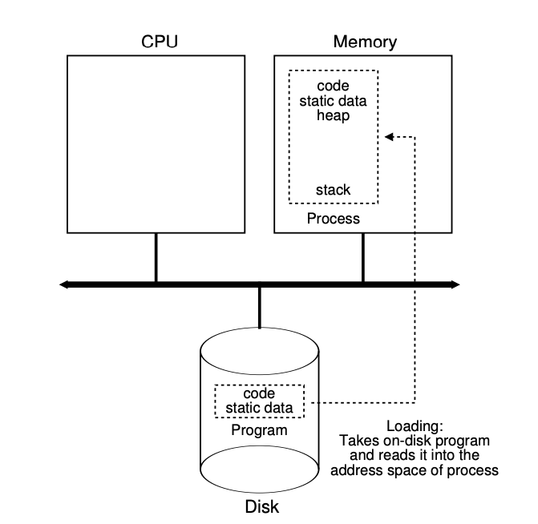
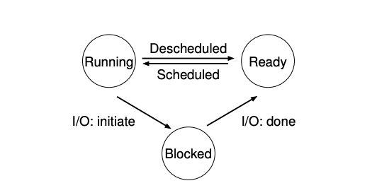

# The Process

<SlideView />

## Introduction

The process is one of the most fundamental abstractions that the OS
provides to users. A process is a running program.

- Address space
- Registers
  - program counter (PC)
  - OR instruction pointer (IP)
- Stack pointer

## Process API

- Create
- Destroy
- Wait
- Miscellaneous Control
- Status

## Loading A process

## Process States

## Data Structures

A process is just a struct!

[Linux Process (`struct task_struct`)](https://elixir.bootlin.com/linux/latest/source/include/linux/sched.h)

## Libraries

A process usually loads shared libraries as well as its own code. The [Libraries](libraries.md)
notes cover dynamic and static linking, dependency types, and the Linux tools for inspecting them
(`ldd`, `nm`, `objdump`, `LD_PRELOAD`, and `ldconfig`).
