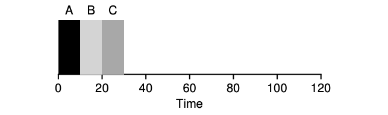
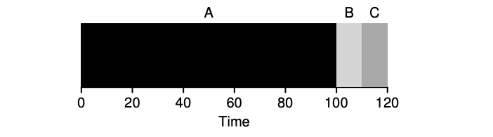
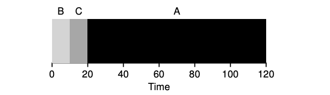

# Scheduling

## First In, First Out (FIFO)

- Most basic algorithm
- Also know as First Come, First Served (FCFS)
- Simple to implement
- Not a great performer

## Perfect

$T\_{turnaround} = \frac{10+10+10}3 = 10$

## Bad Performance

$T\_{turnaround} = \frac{100+110+120}3 = 110$

## Shortest Job First (SJF)

$T\_{turnaround} = \frac{10+20+120}3 = 50$

## Round Robin

The basic idea is simple: instead of running jobs to completion, RR runs
a job for a time slice (sometimes called a scheduling quantum) and then
switches to the next job in the run queue.

## Turnaround Time vs. Response Time

These two metrics often pull in opposite directions:

- **Turnaround time** = completion time − arrival time. Optimized by
  running long jobs without interruption (favors SJF/FIFO).
- **Response time** = first run time − arrival time. Optimized by
  frequently switching between jobs (favors Round Robin).

Round Robin is excellent for response time but terrible for turnaround
time — every job takes longer to finish because it keeps getting
interrupted. There is no single "best" scheduler; the right choice
depends on the workload and what the system is optimizing for.

## Priority Inversion

A subtle hazard in priority-based schedulers: a **high-priority** thread
can be blocked waiting for a resource held by a **low-priority** thread,
while a **medium-priority** thread runs instead, indefinitely preventing
the low-priority thread from releasing the resource. This is called
priority inversion. The classic fix is **priority inheritance**: the
low-priority thread temporarily inherits the high-priority thread's
priority until it releases the resource. The Mars Pathfinder mission
(1997) suffered a real-world priority inversion bug that caused repeated
system resets.

## Advanced Algorithms

The algorithms above are building blocks. Real operating systems use
more sophisticated approaches:

- **Multi-Level Feedback Queue (MLFQ)**: Multiple queues with different
  priorities and time quanta. Jobs that use their full quantum get
  demoted; short, interactive jobs stay at high priority. Approximates
  SJF without knowing job lengths in advance.
- **Completely Fair Scheduler (CFS)**: The default Linux scheduler.
  Tracks each process's "virtual runtime" using a red-black tree and
  always runs the process with the least virtual runtime. Achieves
  fairness across processes with different priorities (nice values).
- **Multiprocessor Scheduling**: Adds the challenge of cache affinity
  (keep a thread on the same CPU to reuse warm caches) and load
  balancing across cores. Single-queue vs. per-CPU-queue designs make
  different trade-offs between simplicity and contention.
