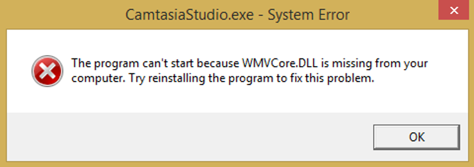
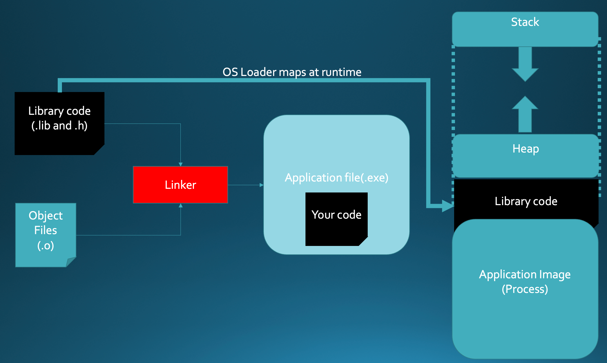
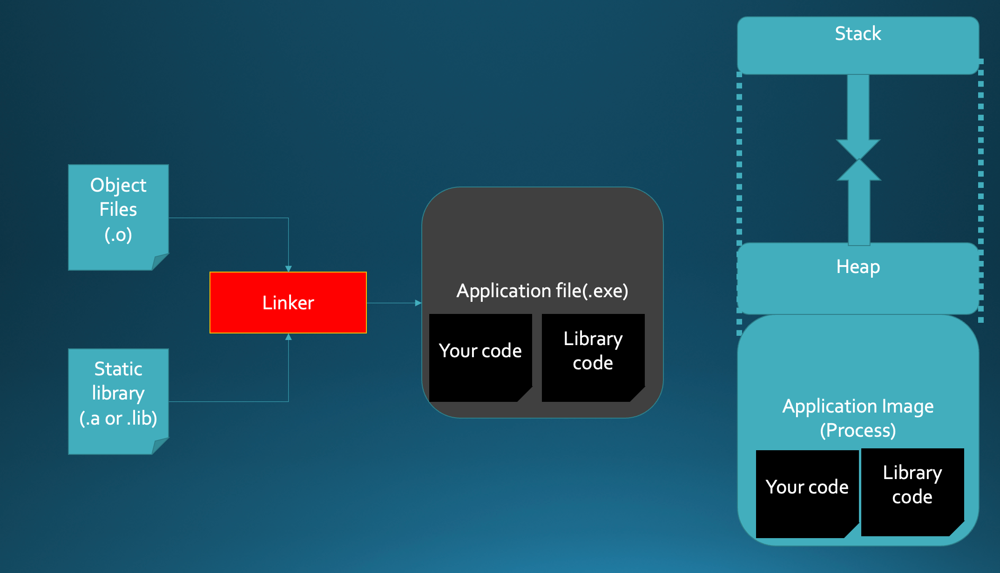
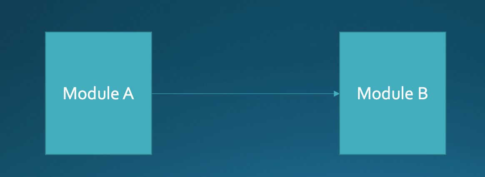
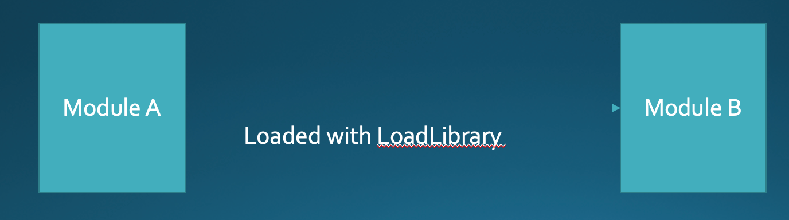
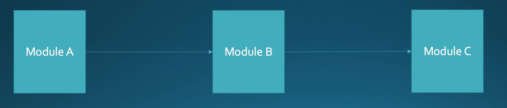

# Libraries

<SlideView />

## Introduction

- A dynamic-link library (DLL or .so) is a module that contains
    functions and data
- Applications (processes) can use the functions and data in the code
- This is the most common way code is distributed.
- Up until this point you have only ever distributed code in an
    executable (exe)

## Dynamic Libraries

- During compile time the linker stubs out calls to the .dll or .so
- The actual implementation is not added into the image that is saved to disk
- The library is mapped into your applications address space at run time

## Load-time dynamic linking

Your code makes explicit calls to exported DLL functions as if they were
local functions.

## Run-time dynamic linking

Functions are loaded with system calls such as `LoadLibrary` or
`LoadLibraryEx` (Win32) or `dlopen`/`dlsym` (POSIX).

```c
#include <dlfcn.h>

void *handle = dlopen("libm.so", RTLD_LAZY);
double (*cos_fn)(double) = dlsym(handle, "cos");
printf("%f\n", cos_fn(3.14));
dlclose(handle);
```

## Advantages of Dynamic Linking

- Multiple processes that load the same DLL at the same base address will share a single copy of the DLL
- When you update a DLL the applications that use them do not need to be recompiled
- Programs written in different programming languages can call the same DLL functions

## Disadvantages of Dynamic Linking



## Loading



## Static Libraries

- Similar to dynamic libraries
- Code is added into your application at compile time instead of
    runtime. The library becomes part of the image saved on disk
- Your application will not have any dependencies that need to be
    resolved at runtime

## Advantages of Static Linking

- All your code is contained in one file (your exe or lib)
- Easier to ship to a customer
- Could be more secure because you know exactly what you are loading
- Eliminates any issues with missing libraries on the host system

## Disadvantages of Static Linking

- Your program is bigger and takes longer to load into memory
- If there is a security flaw in your linked code you will still be using the old version
- If library code get faster or adds support for new hardware you are stuck on the old version



## Dependency Types

## Implicit Dependency

Module A is implicitly linked with Module B at compile/link time



## Explicit Dependency

Module A is not linked with Module B at compile/link time. At runtime,
Module A dynamically loads Module B via a LoadLibrary type function



## Forward Dependency

Module A is linked with a LIB file for Module B at compile/link time,
and Module A's source code actually calls one or more functions in
Module B. One of the functions called in Module B is actually a
forwarded function call to Module C



## Practical Linux Tools

These tools help you inspect libraries and binaries on Linux.

### ldd — list dynamic dependencies

```bash
$ ldd /bin/ls
    linux-vdso.so.1 (0x00007ffd...)
    libselinux.so.1 => /lib/x86_64-linux-gnu/libselinux.so.1
    libc.so.6 => /lib/x86_64-linux-gnu/libc.so.6
```

`ldd` prints every shared library a binary depends on and where the
dynamic linker found it. If a dependency is missing you see "not found" —
this is the root cause of most "works on my machine" failures.

### nm — list symbols in an object file

```bash
$ nm -D /usr/lib/libm.so | grep " cos$"
0000000000026b50 T cos
```

`nm` shows the symbol table. `T` means the symbol is defined in the
text (code) section; `U` means it is undefined (required from another library).

### objdump — disassemble and inspect binaries

```bash
$ objdump -d my_program | head -40   # disassemble
$ objdump -p my_program              # show dynamic section / needed libs
```

### LD_PRELOAD — inject a library at runtime

`LD_PRELOAD` lets you load a custom shared library *before* any other,
overriding symbols from the standard library. This is useful for
debugging and testing:

```bash
# Replace malloc/free with a custom implementation for one run
LD_PRELOAD=./mymalloc.so ./my_program
```

This is also how tools like `strace` and memory profilers intercept
system calls without recompiling the target program.

### ldconfig — rebuild the shared library cache

```bash
sudo ldconfig          # rebuild /etc/ld.so.cache
ldconfig -p | grep ssl # search the cache
```

When you install a new `.so` file the dynamic linker does not
automatically find it. Running `ldconfig` rebuilds the cache that maps
library names to file paths.
