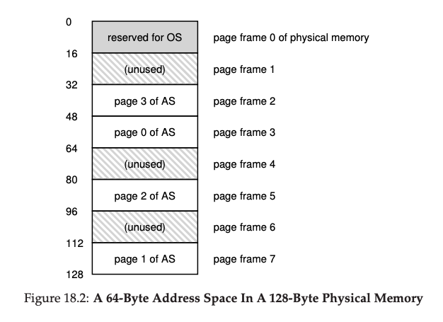
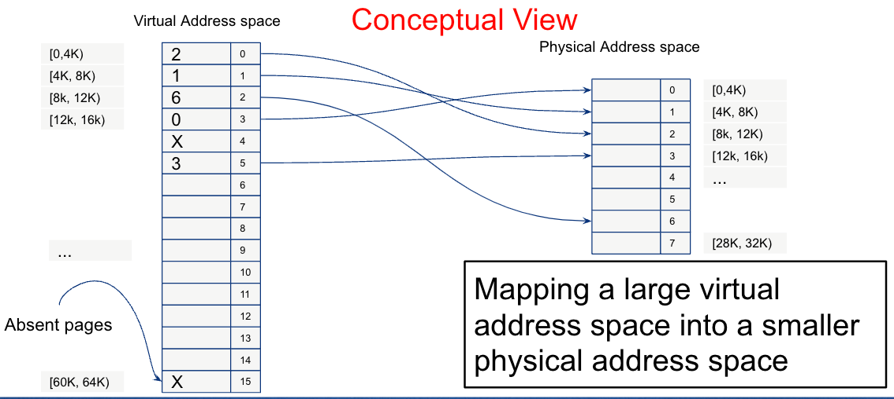
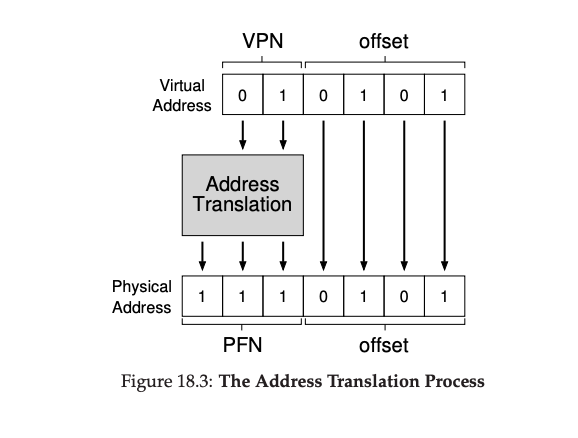

# Paging

Instead of splitting up a process's address space into some number of
variable-sized logical segments (e.g., code, heap, stack), we divide it
into fixed-sized units, each of which we call a page.

- **Page**: a fixed-size chunk of virtual address space (commonly 4 KB)
- **Page frame**: a fixed-size slot in physical memory that holds one page

## Memory



## Page Table

To record where each virtual page of the address space is placed in
physical memory, the operating system usually keeps a per-process data
structure known as a page table. Each entry in the page table is called
a **Page Table Entry (PTE)** and contains:

- The physical frame number
- A **valid bit** (is this page currently in physical memory?)
- A **protection bit** (readable? writable? executable?)
- A **dirty bit** (has the page been written since it was loaded?)
- A **reference bit** (has the page been accessed recently?)

## Virtual Address



A virtual address is split into two parts:
- **VPN (Virtual Page Number)**: index into the page table
- **Offset**: byte position within the page (same in virtual and physical)

## Address Translation



On every memory access the hardware Memory Management Unit (MMU)
performs: `physical_address = page_table[VPN] * page_size + offset`

## The Translation Lookaside Buffer (TLB)

Paging introduces a problem: every memory access now requires *two*
memory accesses — one to look up the page table, one to fetch the actual
data. This would halve memory performance.

The solution is a **TLB** (Translation Lookaside Buffer): a small,
fast, fully-associative hardware cache of recent VPN→PFN translations,
located inside the MMU.

**TLB hit** (common case): the VPN is in the TLB → translation costs
zero extra memory accesses.

**TLB miss** (rare): the VPN is not cached → the hardware (or OS, on
software-managed TLBs like MIPS) walks the page table, loads the
translation into the TLB, and retries. This is expensive.

TLBs work because programs exhibit **locality**:
- *Temporal locality*: recently accessed pages are likely to be accessed again
- *Spatial locality*: pages near recently accessed pages are likely to be accessed soon

A 64-entry TLB with 4 KB pages covers 256 KB of address space — enough
to capture most of a program's working set.

**Context switch cost**: TLB entries are process-specific. On a context
switch the OS must either flush the TLB (expensive) or tag each entry
with an **ASID (Address Space Identifier)** so entries from different
processes can coexist.

## Multi-Level Page Tables

A flat page table for a 64-bit address space would be enormous (terabytes).
Modern systems use **multi-level page tables** to keep page tables sparse.

The virtual address is split into multiple VPN fields, each indexing a
different level of a tree:

```
VPN[0]  VPN[1]  Offset
  │        │       │
  ▼        ▼       ▼
Level-1  Level-2  Physical
 Table    Table    Page
```

Only the portions of the address space that are actually in use need
page table memory. A process that uses only a small fraction of a
64-bit address space has a small page table. x86-64 uses a 4-level
page table; ARM64 supports up to 4 levels as well.

## Page Replacement Algorithms

When physical memory is full and a new page must be brought in, the OS
must **evict** an existing page. Which one to pick?

### Optimal (OPT / MIN)
Evict the page that will be used **furthest in the future**. Provably
optimal, but impossible to implement (requires knowing the future).
Used as a benchmark to evaluate real algorithms.

### FIFO (First In, First Out)
Evict the page that has been in memory the longest. Simple but poor:
evicts frequently-used pages if they were loaded first. Suffers from
**Belady's anomaly** — adding more physical frames can *increase* faults.

### LRU (Least Recently Used)
Evict the page that was used **least recently**. Works well in practice
because of temporal locality. True LRU is expensive (requires tracking
access time for every page), so real systems approximate it.

### Clock Algorithm (Approximation of LRU)
Uses the **reference bit** in each PTE. A clock hand sweeps through
page frames in a circle:
1. If the reference bit is 1, clear it and advance.
2. If the reference bit is 0, evict this page.

The OS clears bits as it sweeps; pages that get used set their bits
again before the hand comes back around. This gives a good LRU
approximation with O(1) cost. Linux uses a variant of this called the
**active/inactive list** approach.

## Swapping

When a process accesses a page with the valid bit set to 0 (not in
physical memory), the CPU raises a **page fault**. The OS page fault
handler:

1. Finds the page on disk (in the swap area)
2. Reads it into a free physical frame (evicting another page if necessary)
3. Updates the PTE and sets the valid bit
4. Restarts the faulting instruction

From the process's perspective, the address space appears larger than
physical RAM — this is the illusion of **virtual memory**.
