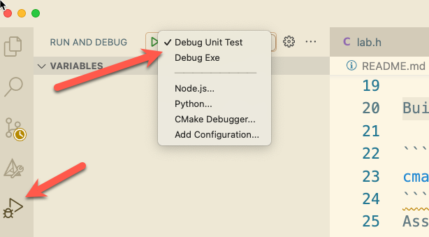

# Project 1


## Overview

This project is intended to serve as an introduction to the project template,
build tools, and process to complete projects during this semester. This project
demonstrates the only **officially** supported tools and programming languages.

This project has been tested on Linux, Windows, and MacOS using github actions.
In _theory_ you could use any operating system you wish to develop and test your
solution. However, supporting 3 different operating systems and their respective
development environments is beyond the capacity of your instructor and GA/TA.
Thus, if you run into trouble on your personal machine you are on your own to
figure out the issues. Additionally, we will be using operating system specific
code through out the semester so some projects will only work on Linux based
systems. Your instructor will support [VSCode](https://code.visualstudio.com/)
on either [Github Codespaces](https://github.com/features/codespaces) or the
computers in the KOUNT learning center.

Students can get a free [Github Pro](https://education.github.com/pack) account
as long as you sign up with your Boise State email address. This will allow you
to use Github Codespaces for free in this class. If you run out of free hours on
codespaces you can use the CS department lab machines to complete the project.
You are NOT required to pay for a Github Pro account to complete this project.

::: info

While students are encouraged to setup their own machine to work on
the project, the instructor and TA/GA will not be able to provide any support
for personal machines. The only supported environment is github codespaces or
the CS department lab machines.

:::

## Learning Outcomes

- 5.1 Use a cross platform build system (win32, posix)
- 5.2 Use a professional unit test framework  (win32, posix)
- 5.3 Use a professional version control system (git)
- 5.4 Explore compiling and running code on at least 2 different systems
- 5.5 Explore how to setup a continuous integration and testing project

## Task 0 - Setup

You will need to create a new project repository for each project. You **must**
use the [repository
template](https://docs.github.com/en/repositories/creating-and-managing-repositories/creating-a-repository-from-a-template#creating-a-repository-from-a-template)
feature to create your project repository. **DO NOT FORK** the project
repository or you will not be able to complete future projects.

1. Use the [project starter](https://github.com/shanep/cs452-project-starter)
   template to create a new project repository in your github account. Name the
   repository `cs452-p0`.
2. Clone your **new** repository to your local machine.
3. Copy the contents of each file in the
   [gist](https://gist.github.com/shanep/0da5e3d33c33bea3ed05ced69432d092) into
   the respective file in your local repository.
4. Add and commit all files to your local repository and then push them to Github.

## Task 1 - Understand Starter Code

Read through `src/lab.h`, `src/lab.cpp`, and `tests/test-lab.cpp` that you
updated to the best of your ability. This project has a bunch of functions to
demonstrate how to use all the tools this semester.

We are going to review the following topics:

1. How to use the build system
2. How to use the unit test framework
3. Demonstrate address sanitizer output
4. How to use the code coverage tool
5. Use the debugger to inspect memory

## Task 2 - Build the project

Follow the steps in the project README.md file to configure and build the project.
You may have to fix some compiler errors to get the project to build.

If you see any warnings about unused parameters (shown below) we can use the
macro `UNUSED(x) (void)(x)` to silence the warning. Generally speaking we do not
want to ignore compiler warnings, but in this case we are demonstrating how to
use a macro so it is OK :).

```bash
 warning: unused parameter ‘argc’ [-Wunused-parameter]
   14 | int myMain(int argc, char **argv)
      |            ~~~~^~~~
 warning: unused parameter ‘argv’ [-Wunused-parameter]
   14 | int myMain(int argc, char **argv)
```

```c
UNUSED(argc);
UNUSED(argv);
```

## Task 3 - Run the Executable

Once you have successfully built the project you can run the executable like this:

```bash
$ ./out/build/x64-ASan/myprogram
What is your name?shane
Hello shane! This is the starter template version: 0.1
```

Not all projects will have an executable to run. Some projects will only
consist of a library that you will link into a test harness.

## Task 4 - Run the tests

Follow the instructions in the project README to run the tests. We will be using
the [Google Test](http://google.github.io/googletest/primer.html#simple-tests)
framework for all our unit tests paired with [Address
Sanitizer](https://clang.llvm.org/docs/AddressSanitizer.html). This approach
will allow us to write high quality code and catch bugs early so when we are
working on larger projects we can focus on the project requirements instead of
the low level details of memory errors. Address sanitizer can detect the
following types of bugs:

- Out-of-bounds accesses to heap, stack and globals
- Use-after-free
- Use-after-return (clang flag
    -fsanitize-address-use-after-return=(never|runtime|always) default:
    runtime)
- Enable runtime with:
    ASAN\_OPTIONS=detect\_stack\_use\_after\_return=1
- Use-after-scope (clang flag -fsanitize-address-use-after-scope)
- Double-free, invalid free
- Memory leaks (experimental and currently only on linux)

You should see a bunch of tests fail.  You need to fix all the issues in the
project before proceeding to the next task. There should be no build warnings,
no disabled tests, and everything should pass.

## Task 5 - Code coverage

Follow the instructions in the project README to run the code coverage tool.
Add enough tests beyond what the professor has given you to get as close to 100%
coverage as possible.

Certain functions like `myMain` do not need a unit test. You can ignore these
by adding a comment `// LCOV_EXCL_START` before the function and a comment
`// LCOV_EXCL_STOP` after the function. This will tell the code coverage tool
to not include that function in the report.

## Task 6 - Run the debugger

We want make sure that we can use the debugger. This project should work out of
the box for both unit tests and the executable. Open the debugger view in VSCode
and set a breakpoint in the `myMain` function and in of the unit test functions.
Run the debugger and verify that the debugger stops at the breakpoints. You will
need to run the debugger separately for the unit tests and the executable.



::: warning

While this task is not graded it is important that you are able to use the
debugger, so don't skip this task. Make sure you can use the debugger **now**
instead of at 11:45pm the night the project is due and there is no one around to
help you.

:::

## Task 7 - Submit the project

In the README.md follow the instructions in the Project Submission Checklist
to submit your project for grading.

## Additional Resources

The following sections contain additional resources that you may find useful when
working on projects in this class. You are encouraged to read through them as they
will provide a good foundation for the rest of the semester.

### VSCode Notes

The VSCode CMake extension (2023-10-17) does not support all the features of
cmake presets that this project uses so if you run into any issues you can
update your settings.json file so that the extension does not complain about the
new features we are using.`"cmake.allowUnsupportedPresetsVersions": true`.

- [VSCode Tips and Tricks](/teaching/vscode-tips-and-tricks.md)
- [VSCode Settings](https://code.visualstudio.com/docs/getstarted/settings)

### Debugging Pointers

In the C programming language we can allocate a chunk of memory on the
heap and treat that chunk of memory as an array. If you are working on
debugging a problem and want to inspect the contents of the array using
the GUI debugger interface in VSCode you may have to tell the debugger
(with a cast) that a pointer is actually pointing to a dynamically
allocated array not a single variable. This example walks through how to
display a pointer as an array that is embedded within a struct.

More reading about C and GDB.

- [Reading C Declarations](http://unixwiz.net/techtips/reading-cdecl.html)
- [GDB Artificial Arrays](https://sourceware.org/gdb/current/onlinedocs/gdb/Arrays.html)
- [GDB to LLDB usage](http://lldb.llvm.org/use/map.html)
- [VSCode Data inspection](https://code.visualstudio.com/docs/editor/debugging#_data-inspection)

Consider the struct declaration `buddy_pool` shown below. The `avail`
member is a pointer that we must dynamically allocate and want to
display in the debugger as an array. We can allocate the a `buddy_pool`
struct (in the stack or data segment) and then dynamically allocate the
`avail` array using `malloc`.

```c
struct avail
{
    int tag;
    int kval;
    struct avail *next;
    struct avail *prev;
}
struct buddy_pool
{
    size_t kval_m;
    uintptr_t base;
    struct avail *avail; /*pointer to the start of the avail array*/
};
struct buddy_pool pool;
pool.kval = 9;
pool.base = 0;
pool.avail = malloc(sizeof(struct avail) * 9);
```

If we run the debugger we will see the variable `pool` with the element
`avail` is displayed as a single variable not an array of 9 structs as
we expected.


The element `avail` is just a pointer to the memory address of element
and the debugger can’t determine the size of the array and thus will
display it as a single struct instead of an array as expected.

Fortunately, all is not lost! Most debuggers allow you to set a watch on
a memory location and you can force the debugger to cast the memory to a
certain type. Both gdb and lldb have specific commands to display a
memory block as an array. However, using casting works regardless of
what debugger you are using.

If we add a new
[watch](https://code.visualstudio.com/docs/editor/debugging#_data-inspection)
on a variable and then force the debugger to display the memory block as
an array instead of a single variable we can easily inspect the data and
track down any issues you are experiencing.

`(struct avail(*) [9])pool->avail`


For a plain old dynamic array you can add a watch expression that is set
to to the desired type.

`*(int(*)[10])A`
