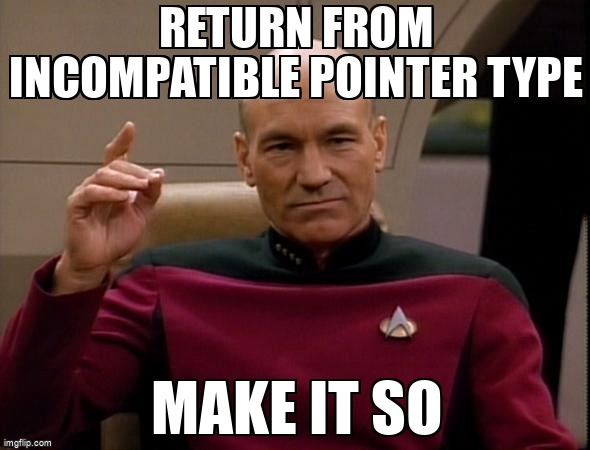

# Project 2



## Overview

This assignment is intended to serve as a warm up assignment. It may have been a
long time since you have written any code in C, so we will get warmed up by
writing a circular doubly linked list. This will allow you get up to speed using
C and refresh your knowledge of pointers, struct's, and manual memory
management.

## Learning Outcomes

This project measures the following course learning outcomes:

- 4.1 Produce code that is free of all memory leaks
- 4.2 Produce code without any out of bounds read/write errors
- 5.1 Use a cross platform build system
- 5.2 Use a professional unit test framework
- 5.3 Use a professional version control system (git)

## Grading Rubric

Make sure and review the class [grading rubric](grading-rubric.md) so you know how your project will
be graded.


## Circular Linked List with Sentinel Node

It is sometimes helpful to draw out what your data structure will look
like in memory before you start coding anything up. Having a visual
model to reference can aid in both development and testing. The diagram
below shows a list with 3 elements and a sentinel node. You can see that
the next pointer in node **n3** points back to the sentinel node and the
prev pointer of **n1** points back to the sentinel node. Each node has a
data pointer that will hold a reference to the data that is being stored
in the list. Using a sentinel node allows us to write slightly simpler
algorithms when manipulating the list.


## Thinking in C

Java is an Object Oriented (OO) programming language while C is an
imperative language. The purpose of both is to break large computing
tasks into smaller ones. While pre-ANSI C (known as K&R C) had very
strange function declarations, functions in ANSI C (C89 and greater)
have a similar look and feel to Java.

One of the biggest differences between functions in C and methods in
Java is Java groups your functions and data together into a class. So in
java if you want to create a new linked list and then add something to
it you would create a new list and then call the **add** method on that
list:

```c
Mylist list = new Mylist();
list.add(new Object());
```

In C the code above would be written as follows:

```c
struct object *obj = create_object();
struct mylist *list = create_list();
list_add(list, obj);
```

So as you can see with the examples above any code that is written in Java using objects can be
translated to C!

<!--@include: ../../../parts/project-setup-boiler.md -->

## Task 2 - Prepare your repository

The starter repository is a bare bones template that you will need to update with the starter code
below.

::: info

This project will be 100% unit test. You will not need to use the file `app/main.c` all your work
will be done int `src/lab.c` and `tests/test-lab.c`

:::

### src/lab.h

<<< @/code/452/p2/lab.h{c}

### tests/test-lab.c

<<< @/code/452/p2/test-lab.c

Once you have updated all the starter code lets make your first commit so everything is saved. Open
up a terminal and lets make a commit!

```bash
git add --all
git commit -m "Added in starter code"
```

## Task 3 - Implement the header file

Implement all the functions defined in `src/lab.h` in `src/lab.c`.

## Task 4 - Write Unit tests

Open up the file `tests/test-lab.c` and add at least 4 new tests beyond what is already provided.

<!--@include: ../../../parts/project-submit-boiler.md -->
