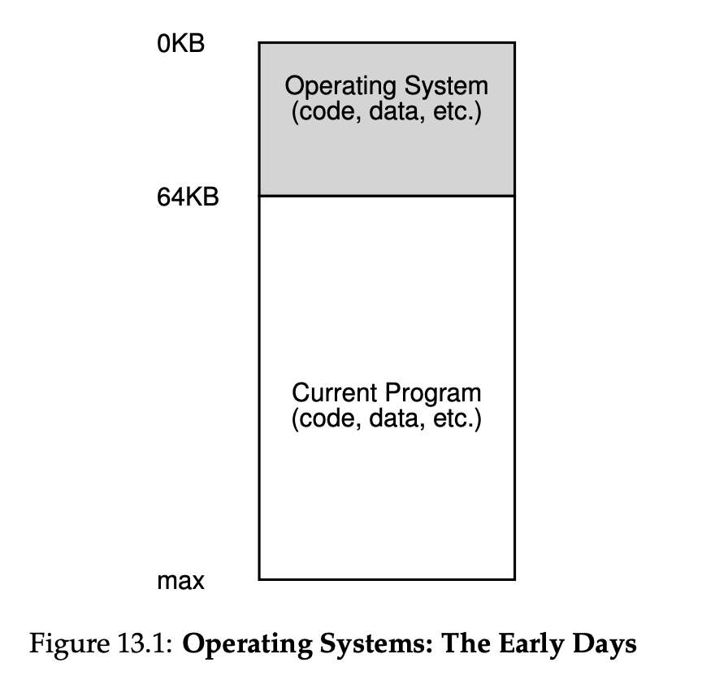
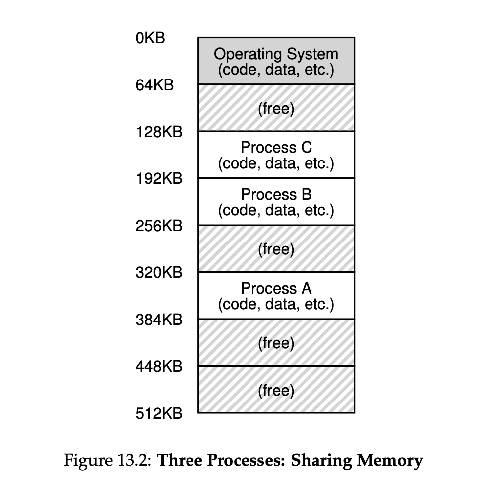
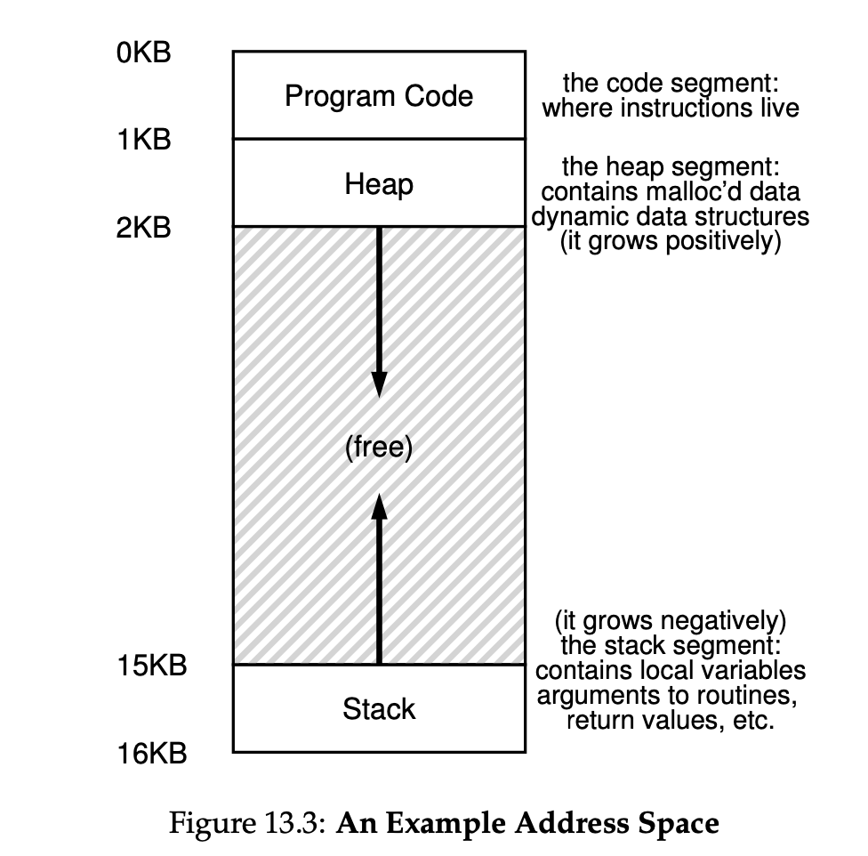

# Address Spaces

- OS was a set of routines (a library) that sat in memory at address 0
- One running program
- Systems were simple!



## Multiprogramming and Time Sharing

- Multiple processes were ready to run at a given time
- Multiple people sharing one system
- Time sharing the hardware
- Systems became interactive!



## The Address Space



## Virtualize Memory

- The OS must virtualize the memory
- All process can’t start at 0!
- But all process think they do?

## Memory Quiz

In class exercise! For all the following slides you will be shown a
snippet of code and will need to determine where the variable lives.

- Data
- Heap
- Stack

```c
int *A;
 void foo(int* bar, int len){
     A = malloc(sizeof(int)*len);
     /*...some code*/
 }
 void main(int argc, char **argv){
     int length =10; int i; int bar[length];
     foo(&bar[0], length);
     /*...some code*/
     free(A);
 }
```

- Length
- bar (in foo)
- bar (in main)
- bar[0]
- argc
- \*A (dereference A)
