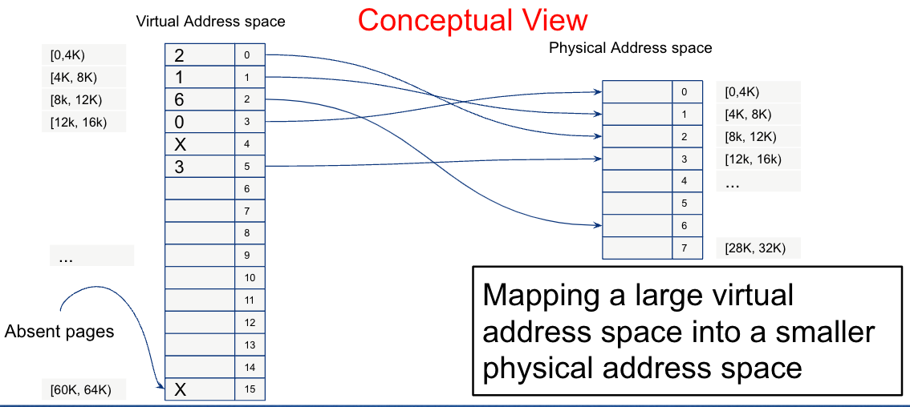
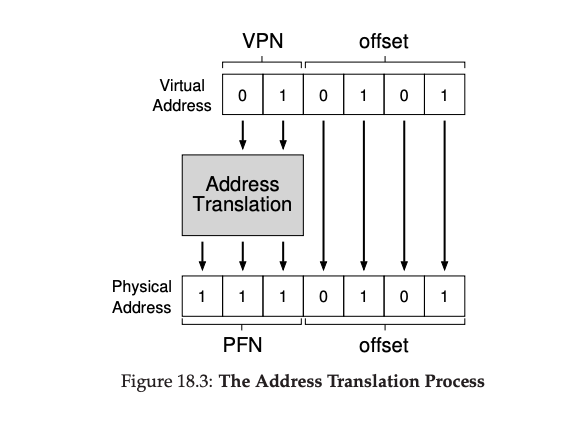

# Paging

Instead of splitting up a process’s address space into some number of
variable-sized logical segments (e.g., code, heap, stack), we divide it
into fixed-sized units, each of which we call a page.

-   page frames - physical memory as an array of fixed-sized slots

# Memory

<figure>

</figure>

# Page Table

To record where each virtual page of the address space is placed in
physical memory, the operating system usually keeps a per-process data
structure known as a page table.

# Virtual Address

<figure>

</figure>

# Address Translation

<figure>

</figure>

# Questions?
