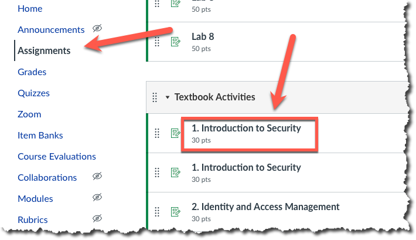
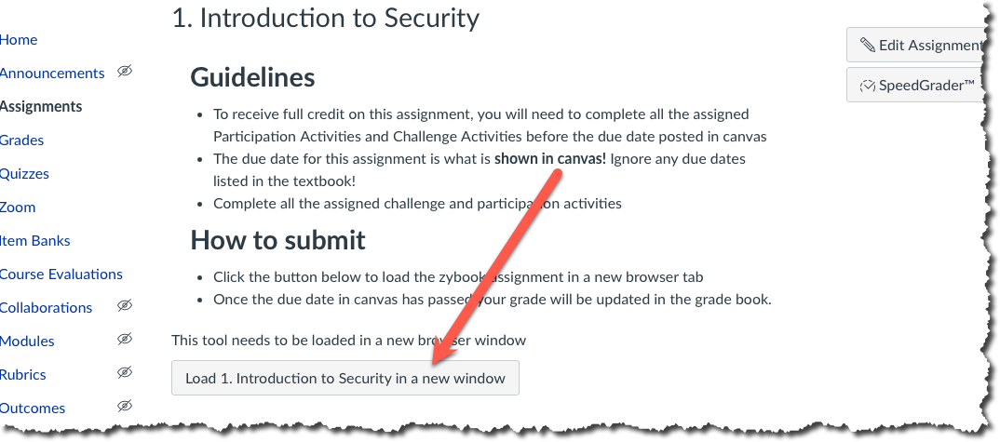
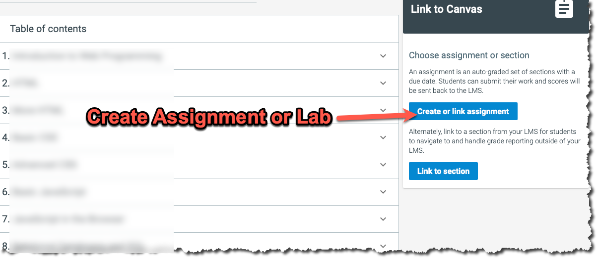
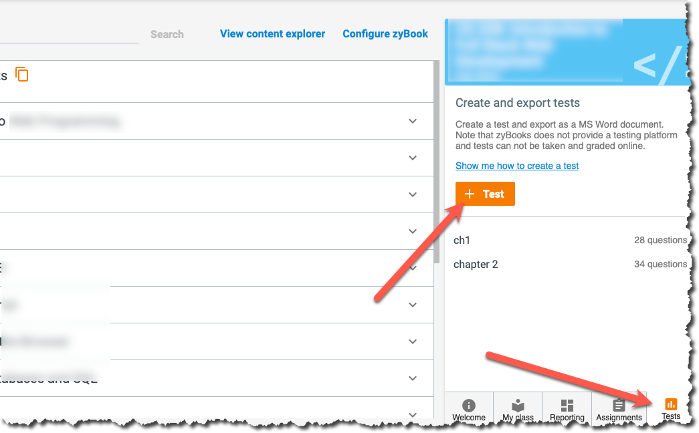
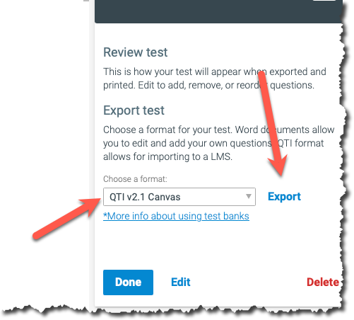

# Adjunct Instructor

This page will walk you through getting your course setup for the first
time. In order to complete these steps you will need a Boise State
provided email, you can not use your personal email to teach your class.

## Setup Canvas

The canvas sandbox site is a bare bones skeleton that you will need to
customize to your liking and teaching style.

1. Email Shane and ask to be added to the class github repository and sandbox course
2. Review the [Canvas Quick-Start](https://boisestate.atlassian.net/wiki/spaces/LTS/pages/160006166/Canvas+Quick-Start)
3. Attend a [canvas training](https://www.boisestate.edu/oit-learning/training-events/) session
4. [Create your
   course](https://boisestate.atlassian.net/wiki/spaces/LTS/pages/1363214337/Creating+a+Single-Section+Canvas+Course+with+Middleware)
   and then [import](https://boisestate.atlassian.net/wiki/spaces/LTS/pages/1369604108/Canvas+to+Canvas+Course+Import+course+copy) the sandbox into your new course.
5. Update the canvas home page with your info and links (TODO comments)
6. Set due dates for all Assignments and Quizzes
7. Verify all links in course are still valid
8. Add in any custom content (slides, documents, etc.)
9. (optional) Create a Welcome video and update the home page
10. (optional) Organize canvas into modules or weeks

## Link zyBooks to your gradebook

The sandbox course is already setup for you to link your zyBook reading assignments and labs back to
your grade book. You will follow these instructions for **both** type of assignments.

- Locate the assignment as shown below.

- Link the assignment

- Choose the correct book in your zyBook account.
- Create your assignment in zyBook

## Create your Quizzes

You can use the built in Quizzes that zyBooks provides in canvas with the steps below.

- Open the test tab to create the test

-  Export the test as a question bank

- [Import the question bank](https://boisestate.atlassian.net/wiki/spaces/LTS/pages/1723891720/Canvas+FAQ+How+do+I+import+quizzes+from+QTI+packages)

## Setup Github (course dependent)

If your class is submitting programming assignments you will need to
setup [github classrooms](github-classroom-setup.md) and then update
each programming assignment in canvas.

Each programming assignment listed in the syllabus is already setup to
use github classroom all you have to do is update the link in the canvas
assignment as shown below.

