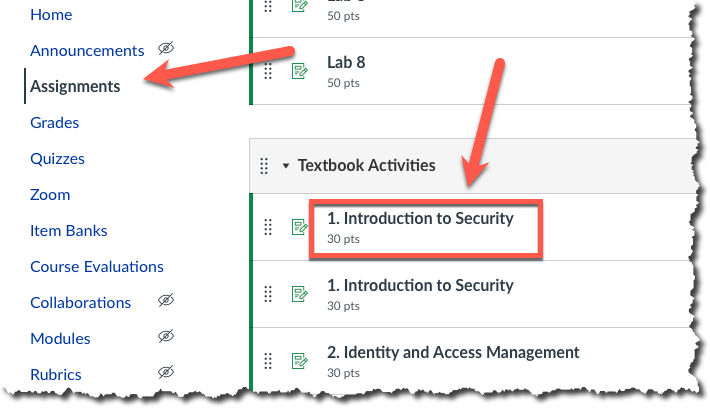
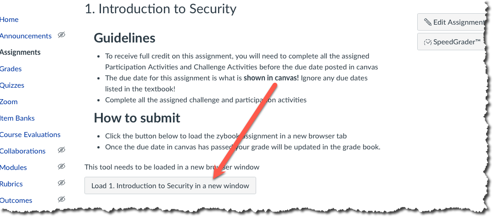
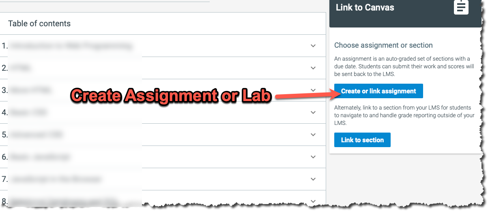
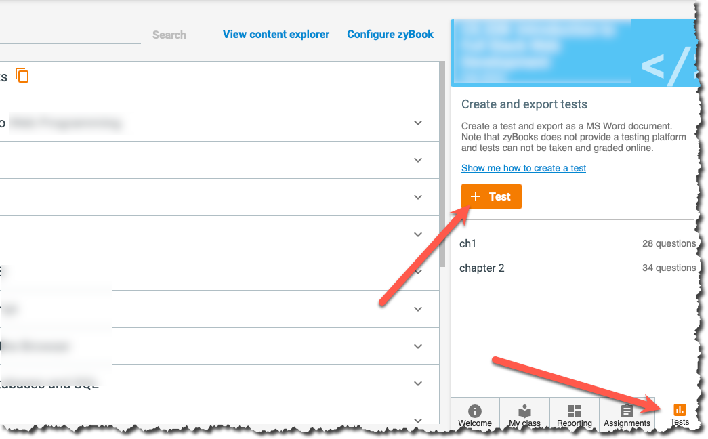
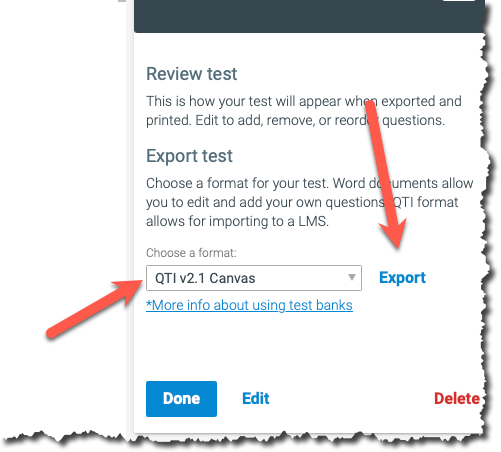
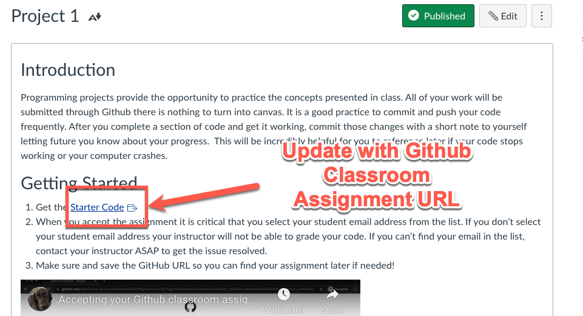

# Adjunct Instructor (Deprecated)

::: danger DEPRECATED
This guide is out of date and the steps below no longer apply. I now send adjunct instructors a
Canvas export of the course with everything already configured, so there is no sandbox to copy
and set up. I am keeping this page here for historical purposes only.
:::

This page is for adjunct instructors teaching a course that I coordinate. It will walk you
through getting your course set up for the first time. In order to complete these steps you will
need a Boise State-provided email. You cannot use your personal email to teach your class.

## Set Up Canvas

The Canvas sandbox site is a bare-bones skeleton that you will need to
customize to your liking and teaching style.

1. Email Shane and ask to be added to the class GitHub repository and sandbox course
2. Review the [Canvas Quick-Start](https://boisestate.atlassian.net/wiki/spaces/LTS/pages/160006166/Canvas+Quick-Start)
3. Attend a [Canvas training](https://www.boisestate.edu/oit-learning/training-events/) session
4. [Create your
   course](https://boisestate.atlassian.net/wiki/spaces/LTS/pages/1363214337/Creating+a+Single-Section+Canvas+Course+with+Middleware)
   and then [import](https://boisestate.atlassian.net/wiki/spaces/LTS/pages/1369604108/Canvas+to+Canvas+Course+Import+course+copy) the sandbox into your new course.
5. Update the Canvas home page with your info and links (TODO comments)
6. Set due dates for all Assignments and Quizzes
7. Verify all links in course are still valid
8. Add in any custom content (slides, documents, etc.)
9. (optional) Create a Welcome video and update the home page
10. (optional) Organize Canvas into modules or weeks

## Link zyBooks to your gradebook

The sandbox course is already set up for you to link your zyBook reading assignments and labs back to
your grade book. You will follow these instructions for **both** types of assignments.

- Locate the assignment as shown below.

- Link the assignment

- Choose the correct book in your zyBook account.
- Create your assignment in zyBook

## Create your Quizzes

You can use the built-in quizzes that zyBooks provides in Canvas with the steps below.

- Open the test tab to create the test

-  Export the test as a question bank

- [Import the question bank](https://boisestate.atlassian.net/wiki/spaces/LTS/pages/1723891720/Canvas+FAQ+How+do+I+import+quizzes+from+QTI+packages)

## Set Up GitHub (course dependent)

If your class is submitting programming assignments you will need to
set up [GitHub Classroom](github-classroom-setup.md) and then update
each programming assignment in Canvas.

Each programming assignment listed in the syllabus is already set up to
use GitHub Classroom. All you have to do is update the link in the Canvas
assignment as shown below.

