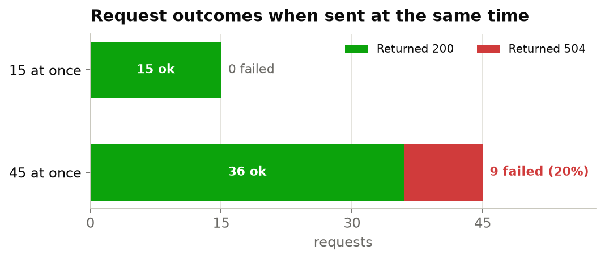
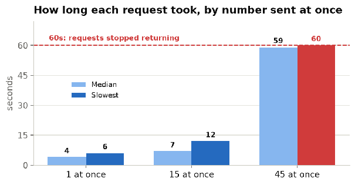
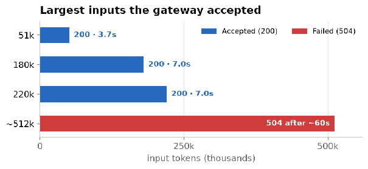

# boisestate.ai Capabilities (as of 10/3/26)

## Summary

The gateway runs Anthropic's Opus model, and for one person at a time it works well and reads
very large inputs. Two things could cause problems if used today. It buckles when a whole class
calls at once: in my test of 45 requests at the same time, 9 failed outright and the rest took a
full minute. And it cannot run tools, so an agentic assistant like Claude Code would be cut down
to a plain chat box.

::: warning NOTE
The limits I hit could be caused by using the same API key and a single IP. A real stress test
using multiple API keys from different machines would be a good idea before this is used in the
classroom at scale.
:::

### What works today

- Single chat requests, about 4 seconds each
- Streaming replies as they are generated
- Multi-turn conversations
- A system prompt to set the assistant's behavior
- Very large inputs, at least 220,000 tokens

### What does not work yet

- A whole class at once (9 of 45 failed in my test), with the testing limitations noted above
- Tool / function calling (needed for Claude Code)
- Image input (text only)
- Rate limit or quota not reported in the API calls. The only place that is listed is in the Web UI.

Temperature control is also missing, but OIT cannot fix that one. Opus 5.5 does not accept
sampling parameters on any platform, so there is no repeatable output for grading.

## 1. How I tested it

I sent HTTP requests to the live endpoint from one machine with my own key and recorded the status
and timing of each. For each capability I sent one request shaped to test it. For timing I ran a
baseline of one request at a time, then bursts of 15 and 45 at once using a short student-style
prompt (a stack vs queue question). For the context limit I sent larger and larger inputs until a
request stopped returning. Two caveats: the load came from one laptop, so 45 separate machines may
differ, and I did not run a flood past 45, which is my actual class size.

## 2. What the gateway can do

| Capability                 | How I confirmed it                                                                                                     |
| :------------------------- | :--------------------------------------------------------------------------------------------------------------------- |
| **Single chat completion** | One user message returned a 200 with a reply, a token count, and `stop_reason: end_turn`.                              |
| **Streaming**              | `"stream": true` returned Server-Sent Events instead of one JSON body.                                                  |
| **Multi-turn**             | A three-message history produced a reply that used a fact from the first message.                                      |
| **System prompt**          | A top-level `system_prompt` changed the reply, and input tokens rose from 17 to 56, so it reached the model.           |
| **Output length cap**      | `max_tokens: 10` cut a long answer off with `stop_reason: max_tokens`.                                                 |
| **Long context**           | 180k and 220k token inputs both returned 200 in about 7 seconds.                                                       |

## 3. What happens when a class uses it at once

This is the finding that matters most for teaching. Measured, not estimated.





One request at a time came back in about 4 seconds. Fifteen at once all succeeded but each took 7
to 12 seconds, so requests sent together slow each other down rather than finishing in parallel.
Forty-five at once ran past the 60 second mark, and at that point 9 of the 45 returned a 504 while
the rest landed right around 60 seconds. A class hitting submit in the same few minutes would see
exactly this. I did not measure where between 15 and 45 the first failure appears.

## 4. How much it can read at once

Good news here. The context is large, so document-heavy assignments are not a problem.



Inputs up to at least 220,000 tokens were accepted and returned in about 7 seconds, so the usable
context is at least that large. I did not find the exact ceiling: a roughly 512k token input
returned a 504 after about 60 seconds, the same point at which the load requests stopped
returning, so I cannot separate a token limit from the time limit here.

## 5. Constraints that affect assignments

| Area                        | What I observed                                                                    | How I confirmed it                                                                                                                                                                                                                                                                     |
| :-------------------------- | :--------------------------------------------------------------------------------- | :------------------------------------------------------------------------------------------------------------------------------------------------------------------------------------------------------------------------------------------------------------------------------------- |
| **Tool / function calling** | Not available. Tool definitions are silently ignored.                              | Sent a weather tool in both the Anthropic `tools` and Bedrock `toolConfig` shapes with a prompt to use it. The model said it had no such tool, `stop_reason` stayed `end_turn`, and input tokens were identical (32) with or without the tool, so the definition never reached the model. |
| **Image input**             | Not accepted. Text only.                                                           | A message with an image content block returned 422.                                                                                                                                                                                                                                    |
| **Sampling controls**       | `temperature` and `top_p` not accepted.                                            | Sent each at several values (0.0, 0.7, 1.5, 0.9). Every one returned 400, even though the API Keys page documents `temperature` and `top_p` (0.0 to 1.0) as supported. This matches Anthropic's own API, where Opus 5.5 rejects sampling parameters outright, so the gateway's docs are out of date, not the endpoint. |
| **System prompt field**     | Only `system_prompt` works. A top-level `system` is ignored and a system role is rejected. | Top-level `system` left the reply and token count unchanged. A system message returned 400, and `system_prompt` changed both.                                                                                                                                                  |
| **Conversation state**      | Stateless: history is resent each call.                                            | No conversation id appears in any response, and multi-turn only worked when I resent the full history.                                                                                                                                                                                 |
| **Model access**            | Unknown or unavailable models are refused. No list endpoint.                       | A made-up model id returned 403 Access denied to model.                                                                                                                                                                                                                                |
| **Rate / quota headers**    | None present.                                                                      | Dumped the full response header set on a 200. No rate-limit, quota, or Retry-After header was returned.                                                                                                                                                                               |

## Why the no-tools limit cannot be fixed on our end

This one surprised me, so here is the plain version. Tool calling is something the model does,
not a switch our software flips. The model only offers to call a tool if that tool is described
inside the request that reaches it. On this gateway, that description is thrown away before the
model is called. When I sent a tool, the model counted the same number of input tokens as when I
sent none, so it never learned the tool was there.

The request path is: Claude Code → a proxy we write → boisestate.ai gateway → the model.

Any adapter we build sits in front of the gateway, not between the gateway and the model. It can
hand the gateway a perfect tool definition, and the gateway will still drop it before calling the
model. The only code that can put tools into the model's request is the code that builds that
request, which is the gateway OIT runs. So no setup on our side restores tool calling. It has to
be changed on the server.

To be clear, the platform does support tools, just not through the API. The Web UI has an agent
builder that binds a model to server-side tools (web browser, code interpreter, Word and Excel,
GitHub, Google Drive, Canvas, Boise State policy and class search, web search, and more), and
those tools run on their servers. What is missing is any way to reach a built agent, or to pass
tools, from the API: the API Keys page documents the whole request as `model_id`, `messages`, and
optional `temperature`, `max_tokens`, `top_p` and `system_prompt`, with no tools field and no way
to name an agent, and sharing an agent only produces a Web UI link. So the absence of tools from
the API looks deliberate, not broken.

## 6. Using it from Claude Code or another CLI

Possible, but it is a small software project, not a settings change, and tools would still be
missing. The request and response shapes I confirmed do not match what these tools expect. The
gateway uses an `X-API-Key` header and its own body and response format, which is neither the
OpenAI shape nor the native Anthropic shape. So each CLI needs a translation layer (a proxy) in
front of the gateway.

- Claude Code can be pointed at a different base URL, but it expects the Anthropic `/v1/messages`
  format, which this gateway does not speak, so it needs a proxy that translates between the two.
  (Claude Code's setup is from its public docs, not something I tested.)
- opencode and most other CLIs accept an OpenAI-compatible endpoint, which again means a proxy
  that maps their format to this gateway.
- The adapter would need to swap the auth header to `X-API-Key`, map the model name to `model_id`
  and the system text to `system_prompt`, flatten message content to plain strings, translate the
  streaming events, and handle the 60s cutoff and the HTML error so the CLI sees a clean failure.

Even with that proxy, tool calling would still be gone (see above), so an agent like Claude Code
could chat with it but could not read files, edit, or run commands. For agent-style coursework,
this gateway is not a fit until OIT passes tools through.

## 7. How it compares to the commercial APIs

The first column is what I confirmed. The others summarize each vendor's public API as a
reference. I did not test them, and vendor details change. This compares the service wrapper, not
model quality. The model here is Anthropic's Opus.

| Dimension                      | boisestate.ai                     | Anthropic API          | OpenAI API        | Google Gemini     |
| :----------------------------- | :-------------------------------- | :--------------------- | :---------------- | :---------------- |
| **Request shape**              | Custom (confirmed)                | Anthropic Messages     | Chat Completions  | GenAI REST        |
| **Auth**                       | `X-API-Key` (confirmed)           | `x-api-key` + version  | Bearer token      | API key           |
| **Streaming**                  | Yes (confirmed)                   | Yes                    | Yes               | Yes               |
| **System prompt**              | `system_prompt` only (confirmed)  | Yes                    | Yes               | Yes               |
| **Temperature / top_p**        | No (matches the model)            | No on Opus 5.5         | Yes               | Yes               |
| **Image input**                | No (confirmed refused)            | Yes                    | Yes               | Yes               |
| **Tool / function calling**    | No (confirmed ignored)            | Yes                    | Yes               | Yes               |
| **Context window**             | ≥220k tokens (confirmed)          | Documented, large      | Documented, large | Documented, large |
| **Rate-limit / quota headers** | None (confirmed absent)           | Yes                    | Yes               | Yes               |
| **Drops into a CLI directly**  | No, needs an adapter              | Largely                | Largely           | Via providers     |

## 8. What I could not determine

- Where the ~60s cutoff is set, and whether it can be raised. I only saw that requests stop
  returning at about 60 seconds.
- Why requests sent together slow down. The timings show it, but the reason is not visible from
  the client.
- How the quota tiers are set, and how close a class would come to them. A quota system does
  exist server-side (tiers and per-user usage tracking, visible in the Web UI and in the
  platform's API schema), but the API does not report usage, so a client cannot see the limits.
- The exact context ceiling. At least 220k works, but above that the time limit gets in the way
  of measuring.

## 9. Recommendation, and what we need to ask OIT for

For individual use the gateway is a good tool right now, and the large context window is a real
plus. Before I build an assignment that has the whole class using it at once, or any assignment
that uses an agent like Claude Code, I would want these from OIT:

- Headroom for a class of 45 at once, so requests do not queue past the cutoff.
- Tool / function calling passed through, which is what unlocks agent-style coursework.
- A clear request timeout and a clean error when one is hit, instead of an HTML 504.

## 10. Appendix: the prompt and sample responses

The load-test request I used and sample responses from my tests, trimmed for length. The key is
shown as `YOUR_API_KEY`.

**The request (load test):**

```bash
curl -X POST "https://boisestate.ai/api/chat/api-converse" \
  -H "Content-Type: application/json" \
  -H "X-API-Key: YOUR_API_KEY" \
  -d '{ "model_id": "global.anthropic.claude-opus-5-5", "max_tokens": 200,
        "messages": [ { "role": "user",
          "content": "Explain the difference between a stack and a queue ..." } ] }'
```

**A normal response (HTTP 200):**

```json
{ "role": "assistant", "content": "Hi! I can help with ...",
  "model_id": "global.anthropic.claude-opus-5-5",
  "usage": { "inputTokens": 19, "outputTokens": 280, "totalTokens": 299 },
  "stop_reason": "end_turn", "reasoning": null }
```

**A streaming response (`"stream": true`):**

```text
event: message_start
data: {"role": "assistant"}

event: content_block_delta
data: {"contentBlockIndex": 0, "type": "text", "text": "1\n2\n3\n4"}

event: message_stop
data: {"stopReason": "end_turn"}

event: metadata
data: {"usage": {"inputTokens": 23, "outputTokens": 11, "totalTokens": 34}}

event: done
data: {}
```

**The tool-calling test (ignored).** `stop_reason` was `end_turn`, and `inputTokens` was 32 with
or without the tool:

```json
{ "role": "assistant",
  "content": "I can't check the weather ... I don't have a get_weather tool ...",
  "stop_reason": "end_turn", "usage": { "inputTokens": 32, "outputTokens": 220 } }
```

**An error response (bad key, HTTP 401):**

```json
{ "detail": "Invalid or expired API key" }
```

_Reproducing this: every result came from HTTP requests to
`POST https://boisestate.ai/api/chat/api-converse` with my key in the `X-API-Key` header: single
calls for the capabilities and error cases, two bursts (15 and 45) of a 200 token prompt for
timing, and growing inputs for the context test. No stress-to-failure flood was run._
