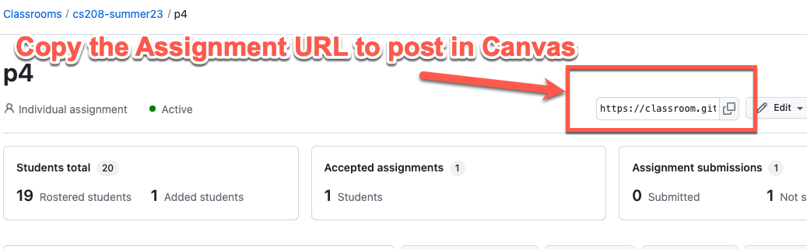
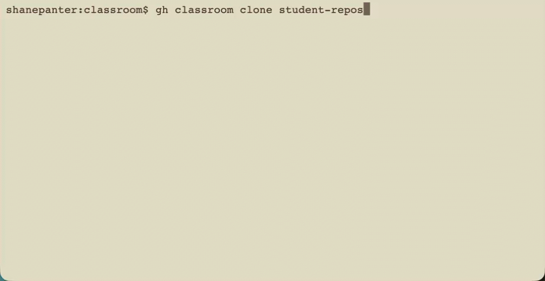
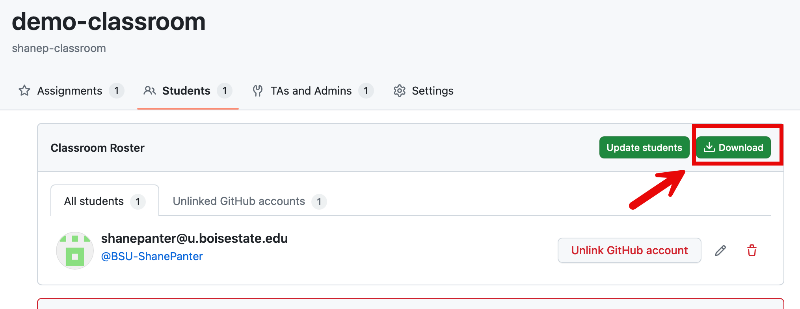

# GitHub Classroom Setup (Deprecated)

::: danger DEPRECATED
GitHub Classroom has been shut down, so none of the steps below work anymore. I am keeping this
guide here for historical purposes only.
:::

This is an opinionated guide to using [GitHub
Classroom](https://classroom.github.com). This guide extends the
[official documentation](https://docs.github.com/en/education/manage-coursework-with-github-classroom/teach-with-github-classroom/manage-classrooms)
with some recommendations on how to set up and configure everything.
After you read through the official documentation you can come back to
this guide to get everything configured.

If you haven’t signed up for an educational account visit the [teacher
portal](https://education.github.com/teachers) first to get all signed
up. While it is not required to get an educational account to use GitHub
Classroom it does give you access to a bunch of goodies that you would
normally have to pay for so it is well worth the time to set up.

If you already have a GitHub Pro account you don’t need to sign up for
an educational account. A GitHub Pro account already has access to
everything you need.

## Step 1 - Create an Organization

The first step is to create a new organization that is specific to the
class in question. It is recommended that you don’t put multiple classes
into one organization because any teaching assistants (TA) or graduate
assistants (GA) must be added as owners of the organization so they can
access the students’ submissions for grading or assisting students during
office hours. Once a TA/GA is added as an owner they can see and access
**all** of the repositories. It is possible, in upper division courses,
to have a TA/GA who is grading for one class and also enrolled as a
student in another.

GitHub has great
[documentation](https://docs.github.com/en/organizations/collaborating-with-groups-in-organizations/creating-a-new-organization-from-scratch)
that will walk you through creating a new organization. Choose the free
tier when given the choice in creating a new organization. During the
setup, I recommend creating a new organization each semester that is
specific to the class with the naming convention such as cs123-fall2023.

It is CRITICAL that you use your personal GitHub account! Do not use
the Boise State account because you can accidentally expose private
repositories (solutions to exams, research, assignments, etc.) to your
TAs and GAs.

## Step 2 - Starter Code Repository

Some courses already have public starter code repositories that should
be listed in the syllabus. If you are teaching a class that already has
starter code repositories set up you can skip this step.

In order to use GitHub Classroom you have to have a starter code
repository. There are three options for starter code repositories that
you can choose, and each is detailed below. All starter code repositories
must be set up as a template repository in order to use GitHub
Classroom. Refer to the GitHub documentation on how to
[create a template repository](https://docs.github.com/en/repositories/creating-and-managing-repositories/creating-a-template-repository).
This repository must be set to public access.

The **recommended** format is the single lab format as it provides the
most flexibility and enables you to use **all** of the features that
GitHub Classroom provides.

- [Example single lab format](https://github.com/shanep/cpp-project-template)
- [Example Empty repository](https://github.com/shanep/github-classroom-blank-starter)
- [Example multi lab format](https://github.com/shanep/github-classroom-multi-lab)

## Single lab format (Recommended)

Each lab (or project) will be in its own repository. There are several
advantages to this setup such as keeping the commit history specific to
one project, minimizing merge conflicts because each project will be
self-contained, and using GitHub pull requests to give feedback to
students. Finally, this format makes it trivial to collect student
samples for ABET purposes.

Students will generally only be pushing code after they accept the
assignment. While it is still possible for students to get merge
conflicts if they are moving between machines (desktop/laptop/lab) this
model helps keep difficult merge conflicts lower because each lab starts
with a fresh repository.

## Empty repository

An empty repository is useful if you don’t want any details about your
project publicly available on GitHub or if you need students to complete
the project entirely from scratch. In either case you can direct
students to any supplemental material through another means such as
Canvas or email.

## Multi lab format

This model supports labs (or projects) that may depend on each other.
For example, you may have a lab where a student implements a data
structure such as a linked list and then uses their data structure in a
future lab. With the multi lab format it is easy for students to
reference and link to previous assignments. This format also gives
students additional practice with using Git which will be valuable when
they graduate and start working in industry.

Be aware that there are a few disadvantages to using this format. One
such disadvantage is you can’t use the due date functionality provided
by [GitHub Classroom](https://classroom.github.com/) and giving
feedback with pull requests does not work without additional work from
the instructor. Finally, students tend to run into more merge conflicts
if the instructor or TA/GA is pushing grading feedback into the repo.

## Step 3 - Create the Classroom

- Sign in to [GitHub Classroom](https://classroom.github.com)
- You can name your classroom whatever you want. It does not impact any
  functionality. A suggested format is to **name your classroom the same name as
  the organization** that you will be using to host the repositories.
- Add in any TAs or grad students that you want to your organization. You can
  add or remove TAs later so you can skip this step on initial creation.
- Unfortunately the connect to Canvas feature does not work for Boise State
  University so you will have to import your class roster manually. I have found
  that it is beneficial to wait until the first or second week of the semester
  to add students to the roster so you don’t have to deal with students adding
  late or dropping the class. Note that GitHub wants the class rosters in CSV or
  one email per line format.

## Step 4 - Create an Assignment

- Create an assignment using the GitHub Classroom web interface. You
    can designate the assignment as a group assignment or individual
    assignment. GitHub Classroom does not have a mechanism to
    automatically divide students into teams, so students will need to know
    the **name** of their team before accepting the assignment. You can
    create teams with whatever method you prefer. I use Canvas to
    automatically create teams as this also sets up the grade book
    correctly. It is recommended that you do **not** give your students
    admin access unless you absolutely know you need
    that feature.
- I typically name the assignment something generic like **p1** or
    **lab1**. That way it makes it easier to use and script the command
    line downloader.
- Set the template repository that you created previously.

Don’t use the **supported editor** feature as it seems to break for some
students.

- Add in any auto-grading that you want. These will be run using GitHub
    Actions.
- (Optional) Set up the assignment to use GitHub pull requests for
    student feedback.
- (Optional) Create a Canvas assignment using the [GitHub Classroom
    Template](https://lor.instructure.com/resources/9b6484a4aa864d979cf0506e468c6052?shared)
    and update the link in the template with the link generated by
    GitHub Classroom.

While VS Code is not required to use GitHub or GitHub Classroom it has
phenomenal integration with GitHub that makes it trivial to work with
repositories. VS Code is the recommended way for students to interact
with GitHub.

## Copy Assignment URL

Copy the Assignment URL as shown below and post the URL to your Canvas
site so students can access the assignment.



## Admin access

Generally speaking students do not need admin access to their own
repositories. Here are a few cases where they **do** need admin access.

- You want students to be able to add other parties to their repo but
    don’t want those individuals to be on your class roster. This
    situation can come up if your students need to collaborate with
    another department or external company such as in a senior design or
    capstone class.
- You want students to be able to create a GitHub project page to
    showcase their work.
- You are doing a project that requires students to author their own
    GitHub Actions.

## Step 5: Download student submissions

- Install GitHub CLI by following the
  [GitHub CLI installation instructions](https://cli.github.com/).
- Authenticate GitHub CLI by running the following command in your terminal:

    ```bash
    gh auth login
    ```

- Install the official GitHub Classroom CLI tool by running the following command:

    ```bash
    gh extension install github/gh-classroom
    ```

- Navigate to the directory where you want to download student submissions.
- The [official](https://docs.github.com/en/education/manage-coursework-with-github-classroom/teach-with-github-classroom/using-github-classroom-with-github-cli) docs detail all the
  options for downloading student submissions using the CLI tool.
- To download all submissions for a specific assignment, run the following command:

    ```bash
    gh classroom clone student-repos
    ```



### Renaming directories (optional)

Get the classroom roster from the GitHub Classroom web interface by going to
the classroom and clicking on the "Students" tab. Download the roster
as a CSV file and put it in the same directory where you downloaded the student
submissions.



The GitHub CLI names the directories with the assignment name followed by the
student's GitHub username. For easier scripting you can use
[this](https://gist.github.com/shanep/5226245d533f436a364b7c8a2267018a) script
to rename all the directories to be their university email.

- Get the student submissions:

```
shanepanter:classroom$ gh classroom clone student-repos
? Select a classroom: demo-classroom
? Select an assignment: p1
Creating directory:  /Users/shanepanter/classroom/p1-submissions
Cloning into: /Users/shanepanter/classroom/p1-submissions/p1-BSU-ShanePanter
Cloned 1 repos.
```

Here is what your directory should look like before running the script:

```
shanepanter:classroom$ tree
.
├── classroom_roster.csv
├── p1-submissions
│   └── p1-BSU-ShanePanter
│       ├── hello.c
│       ├── LICENSE
│       ├── README.md
│       └── test-ssh-stuff
└── rename-repos.sh

2 directories, 6 files
```

- Run the rename script, passing the same assignment name that `gh classroom` used when
  downloading the repos (`p1` in this example):

```bash
./rename-repos.sh classroom_roster.csv p1
```

- After running the script the directories will be renamed to their university email:

```
shanepanter:classroom$ ./rename-repos.sh classroom_roster.csv p1
✔ Successfully renamed p1-submissions/p1-BSU-ShanePanter to p1-submissions/shanepanter@u.boisestate.edu
shanepanter:classroom$ tree
.
├── classroom_roster.csv
├── p1-submissions
│   └── shanepanter@u.boisestate.edu
│       ├── hello.c
│       ├── LICENSE
│       ├── README.md
│       └── test-ssh-stuff
└── rename-repos.sh

2 directories, 6 files
```

## Legacy Downloading

Before the official CLI tool was released we had our own method for downloading
student submissions called `ghclass`. While it is recommended to use the official CLI
tool above, if you want to use the legacy tool you can find it here:
[ghclass](https://github.com/shanep/ghclass).
