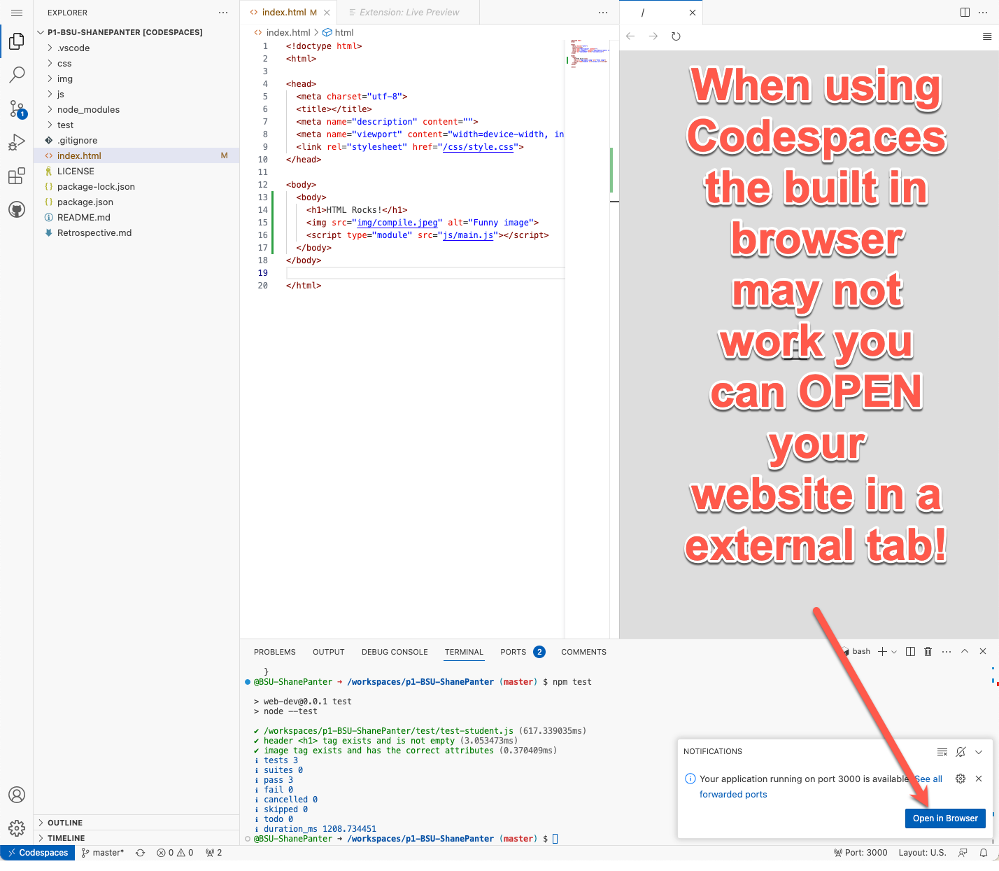
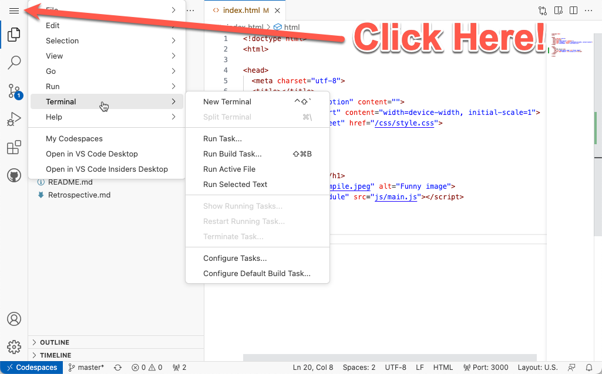
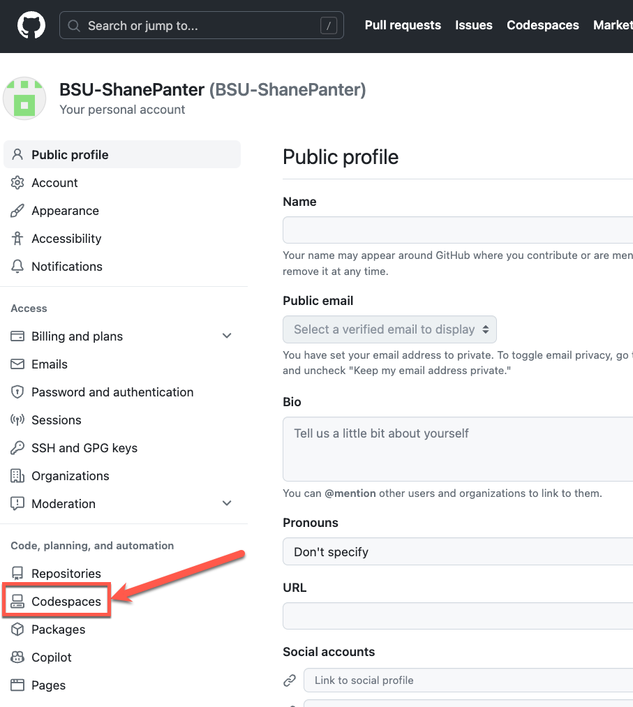

# GitHub Codespaces

This section is not required for all classes. Please check your class syllabus
to see if developing in the cloud is required. If using codespaces is not
required in your class you can skip this section.

[GitHub Codespaces](https://github.com/features/codespaces) is a
complete VSCode development environment in the cloud. It is the quickest
and easiest way to write code on any machine that has an internet
connection and web browser. GitHub Codespaces provides a free tier (60
hours) that should be enough cover all the usage for a student working
on homework. However, you still may need to pay a small fee depending on
how much you use the service over the course of a semester.

- [Codespaces Billing](https://docs.github.com/en/billing/managing-billing-for-github-codespaces/about-billing-for-github-codespaces)
- [Codespaces Documentation](https://docs.github.com/en/codespaces)

## Starting a Codespace

Every repository will need its own Codespace. Creating a Codespace is
fairly straight forward after you have cloned your repository simply
click the **code button** and then click the **Create Codespaces** as
shown below. This will launch a Codespace that you can use to work on
your project.

## Configuring Codespace

When you are working remote VSCode does not automatically install any of
your extensions. To get all your remote extensions installed open the
[Extension manager](https://code.visualstudio.com/docs/editor/extension-gallery)
and then select the local extensions that you wish to install on the
remote machine. The first extension that you should install is Live
Preview as shown below.

## Remote Website Development

As long as you are using the [integrated
terminal](https://code.visualstudio.com/docs/editor/integrated-terminal)
in VSCode you can launch a website that you built on the server and
VSCode will automatically forward the ports for you so you can view it
locally. For simple websites that don’t need to run a web server you can
use the Live preview feature. After you have installed the VScode Live
preview extension you can start the built in web server just as you
would when developing locally.

Sometimes you will see an error when trying to view your website (shown
below). This is because there is sometimes a delay on how fast
Codespaces sets up port forwarding. If you click the "Open in Browser"
popup it should open up a new tab showing you your website.

## Running a Web Server

For more complicated setups like when you want to run a PHP server
server from Nodejs, you can start the server just like you normally
would and then view you website from the ports tab show below.

## Accessing the menu in Codespaces

For the most part using Codespaces is identical to developing remotely.
One of the biggest differences is accessing the Menu toolbar. The
screenshot below shows you how to access the toolbar in Codespaces.

## Codespaces Set default timeout

The default idle timeout for codespaces is 30 minutes. You can quickly
burn through all your free hours if you keep this default. I recommend
that you set the default timeout to 10 minutes to preserve your free
tier time.

