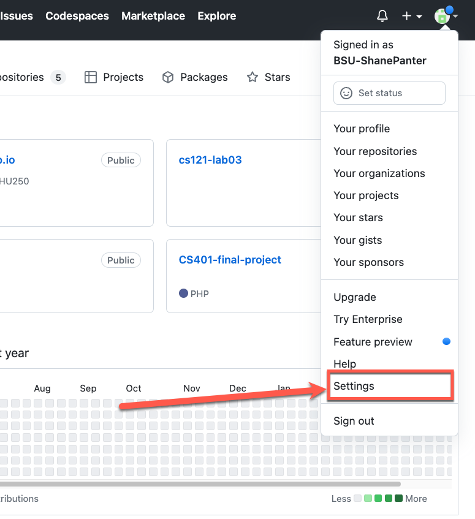
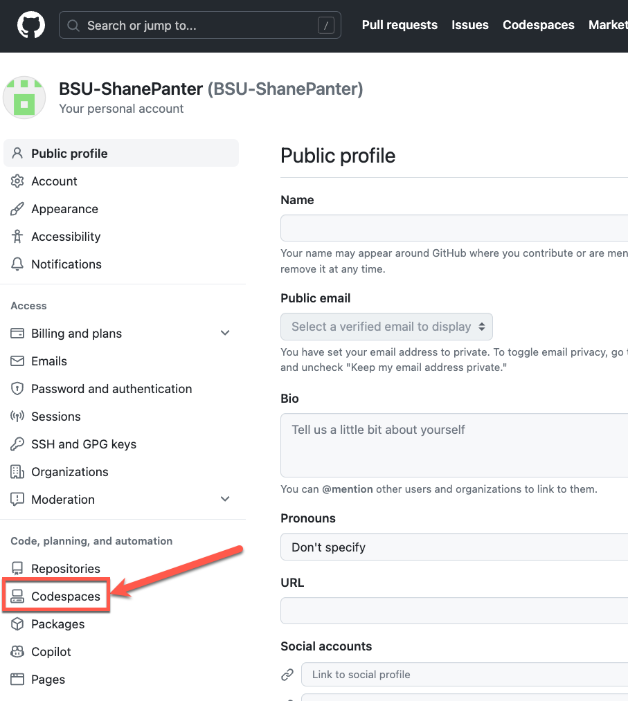
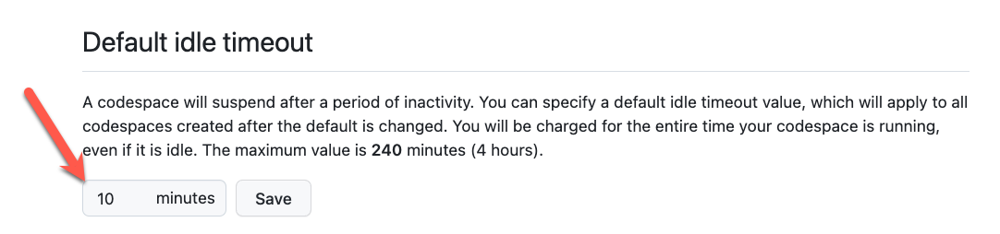
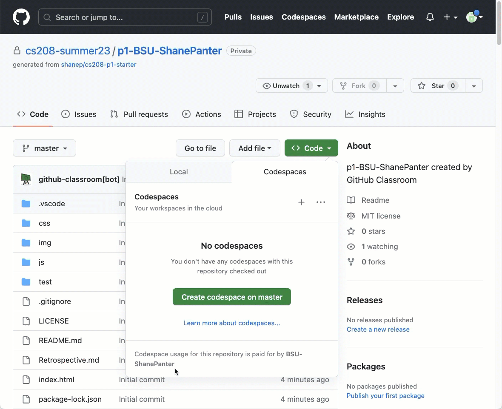
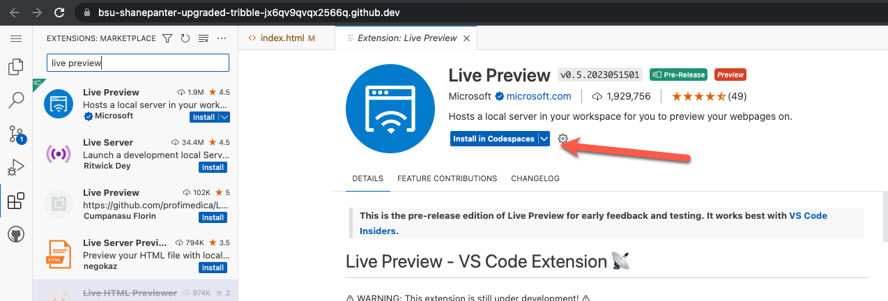
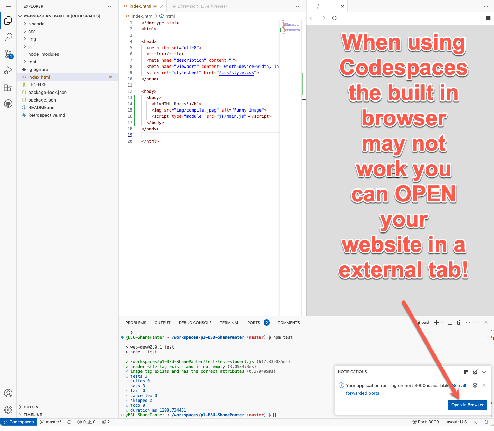
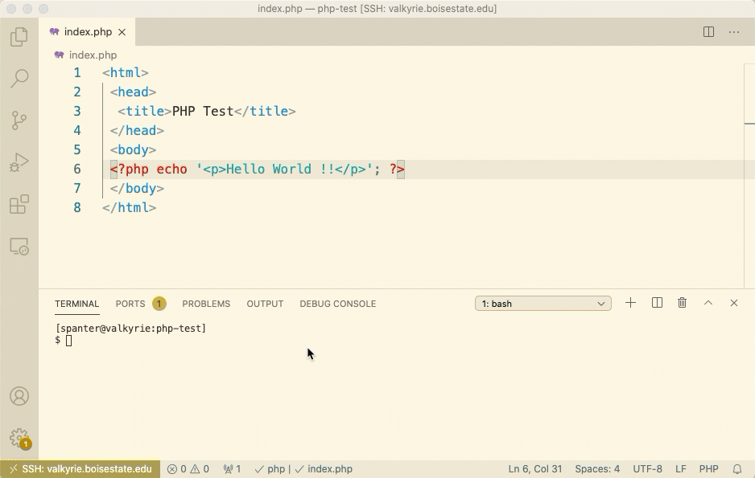
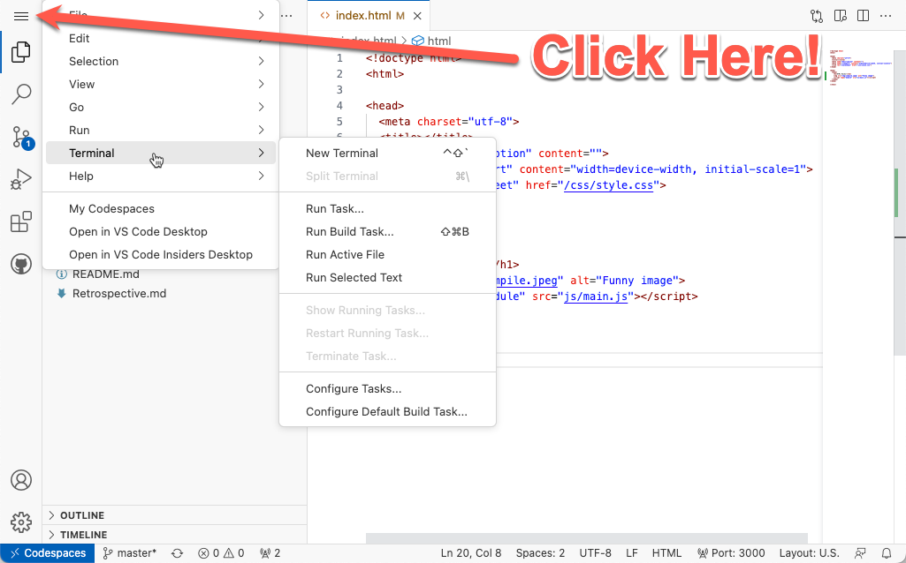

# GitHub Codespaces

This guide is not required for all classes. Check your class syllabus to see if developing in the
cloud is required, and if it is not you can skip this page.

[GitHub Codespaces](https://github.com/features/codespaces) is just VS Code in the cloud. You get
a full Linux machine with a terminal and an editor, and all you need is a web browser. It is the
quickest way to start working on a project from any computer, including a Chromebook or a lab
machine where you cannot install anything.

- [Codespaces Documentation](https://docs.github.com/en/codespaces)
- [Codespaces Billing](https://docs.github.com/en/billing/concepts/product-billing/github-codespaces)

## How many free hours do you get?

Codespaces is free up to a monthly quota, and the quota is counted in **core hours**, not clock
hours. The default machine has 2 cores, so every hour you have it running uses 2 core hours.

| Account     | Core hours per month | Hours on a 2-core machine | Storage per month |
| :---------- | :------------------- | :------------------------ | :---------------- |
| GitHub Free | 120                  | 60                        | 15 GB             |
| GitHub Pro  | 180                  | 90                        | 20 GB             |

If you are a student, sign up for [GitHub Education](https://education.github.com/pack). Verified
students get the same Codespaces quota as GitHub Pro for free (plus a bunch of other goodies).

60 hours a month (90 with GitHub Education) is plenty for homework as long as your Codespace is
not sitting there running while you are not using it. That is what the next step is for.

## Step 1 - Set your idle timeout

A Codespace keeps running (and using your hours) until it has been idle long enough to stop on
its own. The default idle timeout is 30 minutes, so every time you walk away without stopping it
you burn an hour of your quota. I recommend setting the timeout to 10 minutes. Do this **before**
you create your first Codespace.

1. Click your profile picture in the upper-right corner of github.com and select **Settings**.
2. In the sidebar under "Code, planning, and automation", click **Codespaces**.
3. Under **Default idle timeout**, enter `10` and click **Save**.

## Step 2 - Create a Codespace

You do not need to clone your repository first. Open your repository on github.com, click the
green **Code** button, select the **Codespaces** tab, and click **Create codespace** as shown
below. It takes a minute or two the first time while GitHub builds the machine.

Every repository gets its own Codespace. When you come back to work on the same project, open your
existing Codespace from [github.com/codespaces](https://github.com/codespaces) instead of creating
a new one. Every Codespace you create uses up storage, even when it is stopped.

## Step 3 - Install your extensions

Your Codespace does not come with the extensions you have installed on your own computer. Open the
[Extensions view](https://code.visualstudio.com/docs/editor/extension-marketplace) and install
the ones you need for your class. For web development the first one you should install is Live
Preview, as shown below.

::: tip
If your starter repository has a `.devcontainer` folder, your instructor has already listed the
extensions you need and they are installed for you when the Codespace is created.
:::

## Step 4 - Push your work and stop your Codespace

Make sure and commit and push your work before you walk away. Your Codespace is a separate
machine, so anything that is not pushed to GitHub only lives there.

::: danger
GitHub deletes a Codespace that has been stopped and unused for 30 days, and any work you did not
push is deleted with it. Push your work every time you finish a session!
:::

Once your work is pushed, stop the Codespace so it does not keep counting against your hours
until the idle timeout kicks in. You can do this two ways:

- Open the Command Palette (`Ctrl+Shift+P`) and run **Codespaces: Stop Current Codespace**
- Go to [github.com/codespaces](https://github.com/codespaces), click the **...** next to your
  Codespace, and select **Stop codespace**

When the semester is over, delete the Codespaces you no longer need from the same page so they
stop using your storage quota.

## Viewing a website

As long as you start your web server from the [integrated
terminal](https://code.visualstudio.com/docs/terminal/basics), VS Code forwards the port for you
so you can view the site in your own browser.

For simple websites that do not need a web server, use the Live Preview extension from Step 3 and
start its built-in web server just like you would when developing locally.

Sometimes you will see an error the first time you try to view your website (shown below). This
is because Codespaces can take a few seconds to set up port forwarding. Click the **Open in
Browser** popup and it should open a new tab with your website.

For anything that runs its own server (PHP, Node.js, Python, etc.), start the server just like you
normally would and then open your website from the **Ports** tab as shown below.

## Finding the menu

For the most part using Codespaces is identical to using VS Code on your own computer. The
biggest difference is the menu bar (File, Edit, View, ...), which is hidden behind the menu button
in the upper-left corner as shown below.

