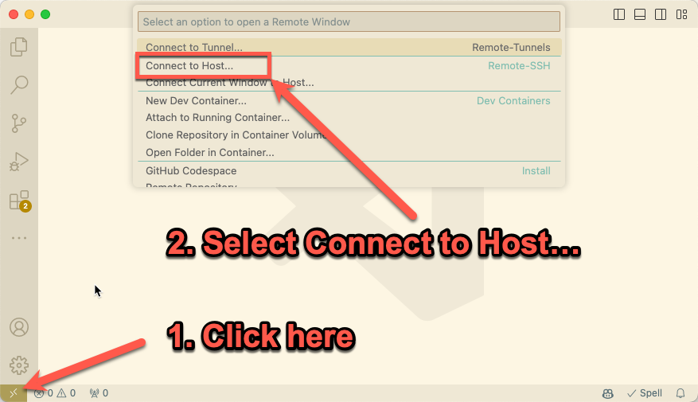
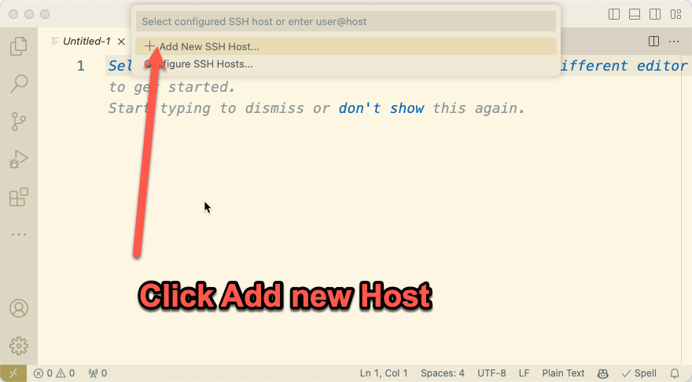
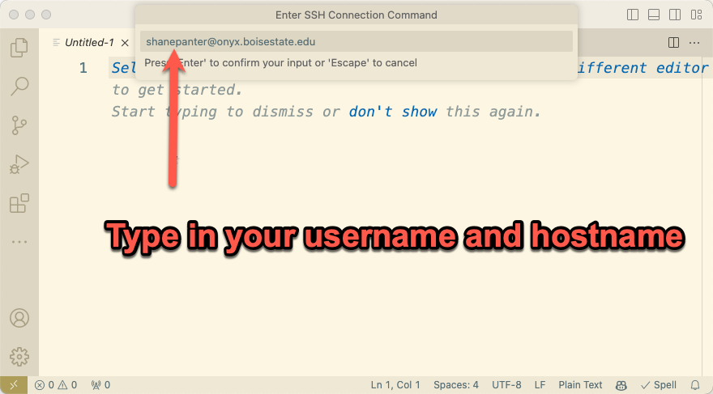
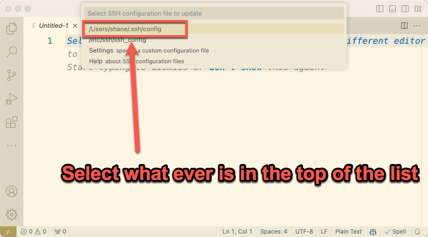
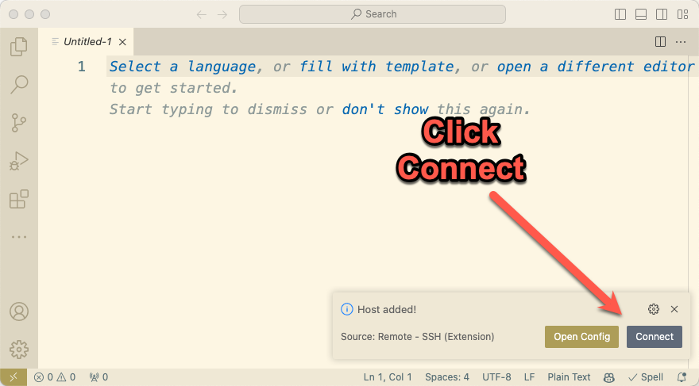
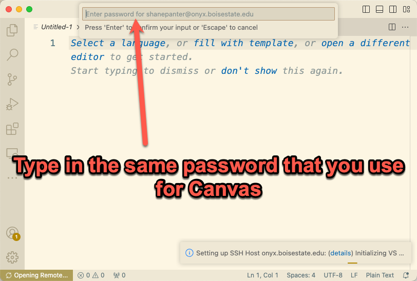
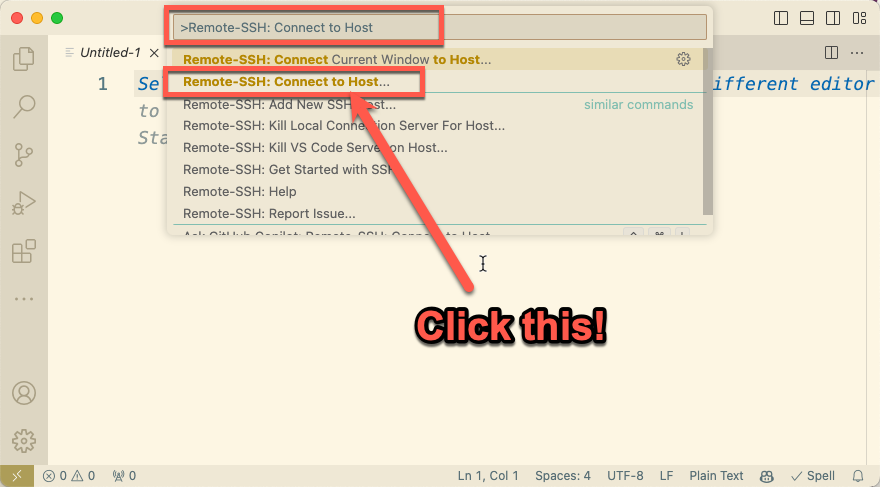
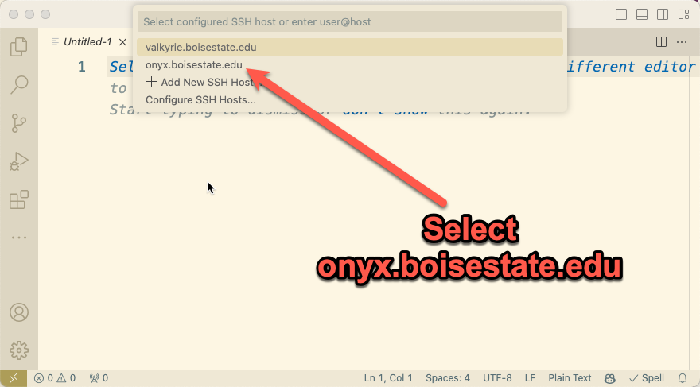

# Developing Remotely

::: info
This section is optional and is provided for students who wish to
develop remotely. You are not required to develop remotely, all the
homework assignments can be done on the CS lab machines in the CCP
building.

Your professor or teaching assistant can not provide tech support
for personal machines.
:::

This section will walk you through using VSCode to develop remotely.
This is incredibly convenient as it allows you to connect directly to a
server to run and test your code. For advanced users you can read
through the [official
documentation](https://code.visualstudio.com/docs/remote/ssh) for more
details on how everything works.

## Setup a Remote Connection

- First you need to install the [Remote development extension
  pack](https://marketplace.visualstudio.com/items?itemName=ms-vscode-remote.vscode-remote-extensionpack)
- Click in the lower left hand corner and then select "Connect to Host..." as shown in the screenshot below.

- Select "+ Add New SSH Host..."

- Type in your username and host name. Your username is the same
  as your BSU email. For example, if your email is jimbob@u.boisestate.edu then your username is
  **jimbob**. The host name will be onyx.boisestate.edu. So the connection string will be
  **jimbob@onyx.boisestate.edu**.  
- Select the default ssh configuration profile

- Select Connect on the pop up in the lower right of your screen.

- Enter in your password

- Here is the entire process

:::info
Depending on your operating system you may see slightly different popups that what is shown in the
screenshots above. That is to be expected and should not impact your ability to connect to onyx.boisestate.edu.
:::

### Verify your connection

Once you are connected you can verify your status as shown below:

1. You should see SSH: onyx.boisestate.edu
2. When you run the command *hostname* in the integrated terminal you should see onyx.boisestate.edu
3. When you run the command *whoami* in the integrated terminal you should see your Boise State
   username.

## Installing remote extensions

When you are working remote VSCode does not automatically install any of
your extensions. To get all your remote extensions installed open the
[Extension
manager](https://code.visualstudio.com/docs/editor/extension-gallery)
and then select the local extensions that you wish to install on the
remote machine.

## Connect to an Existing Remote

Assuming you have followed the steps above to setup a new remote connection you can now reconnect
anytime.

- Select *Remote-SSH: Connect to Host…​* from the Command Palette and connect to *username@servername.com*
:::tip
You can bring up the Command Palette by hitting the F1 key
:::

- Select connect to started developing

:::tip
The first time you connect it may take some time for VSCode to install all the tools so be patient
and don’t close or stop the process or it could cause your install to fail!
:::

