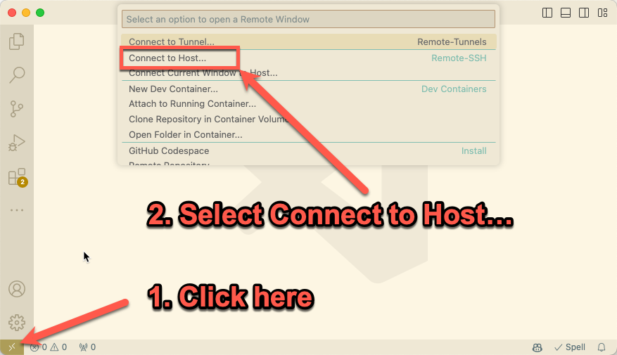
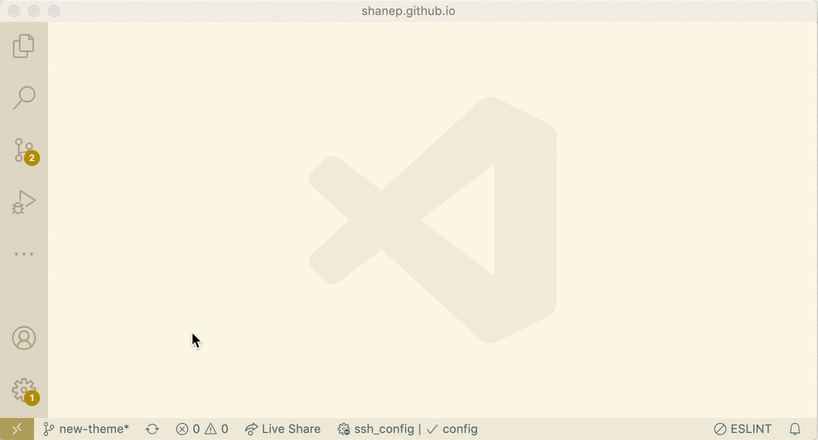
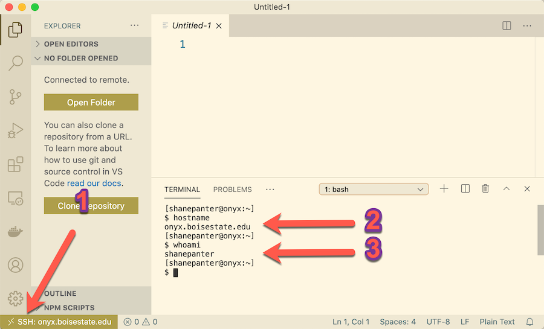
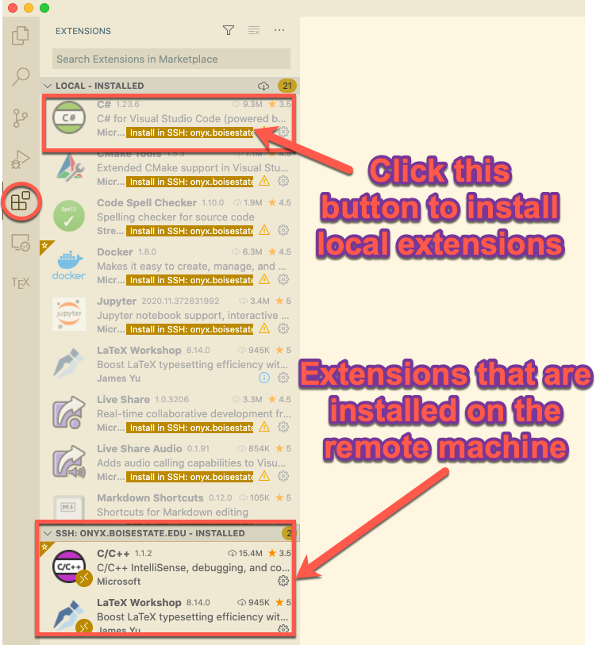

# VS Code Remote Development

This guide walks you through connecting VS Code on your computer to Onyx, the CS department's
Linux server. The editor runs on your laptop, but your files, the terminal, and every program you
build and run live on Onyx. You get a nice editor and a real Linux machine without installing
Linux yourself. See the [official
documentation](https://code.visualstudio.com/docs/remote/ssh) if you want the details on how it
all works.

Developing remotely is optional. All of the homework can be done on the CS lab machines in the CCP
building, or in [GitHub Codespaces](github-codespaces.md). Your professor or teaching assistant
can not provide tech support for personal machines.

## Step 1 - Install the extension

Install the [Remote
Development](https://marketplace.visualstudio.com/items?itemName=ms-vscode-remote.vscode-remote-extensionpack)
extension pack in VS Code. It includes Remote - SSH, which is the part we need.

## Step 2 - Setup an SSH key

Without an SSH key you will type your Onyx password every single time VS Code connects, and VS
Code connects more often than you think. Setup a key once and you never type it again. You only
need to do this step once per laptop.

Open a terminal on your laptop (on Windows, use Git Bash) and generate a key. Press Enter to accept
the default file, and pick a passphrase or leave it empty.

```bash
ssh-keygen -t ed25519 -C "you@u.boisestate.edu"
```

Copy your public key to Onyx. Your username is the first part of your Boise State email, so if
your email is `jimbob@u.boisestate.edu` your username is `jimbob`. This is the last time you will
type your Onyx password.

```bash
ssh-copy-id jimbob@onyx.boisestate.edu
```

::: details ssh-copy-id: command not found
Some Windows setups do not include `ssh-copy-id`. Print your public key on your laptop and copy
the line that starts with `ssh-ed25519`.

```bash
cat ~/.ssh/id_ed25519.pub
```

Then log in to Onyx with your password and add that line to your `authorized_keys` file.

```bash
ssh jimbob@onyx.boisestate.edu
mkdir -p ~/.ssh
echo 'ssh-ed25519 AAAA... you@u.boisestate.edu' >> ~/.ssh/authorized_keys
chmod 700 ~/.ssh
chmod 600 ~/.ssh/authorized_keys
exit
```
:::

Last, give Onyx a short name. Add this to the file `~/.ssh/config` on your laptop (create it if
it does not exist), using your own username.

```text
Host onyx
    HostName onyx.boisestate.edu
    User jimbob
```

Now test it. You should land on Onyx without being asked for a password.

```bash
ssh onyx
```

## Step 3 - Connect from VS Code

1. Click the **Open a Remote Window** button in the lower left corner of VS Code and select
   **Connect to Host...** as shown below.

   

2. Select **onyx** from the list. VS Code reads the list from the `~/.ssh/config` file you created
   in Step 2. If it asks what kind of server it is, select **Linux**.

3. Wait. The first time you connect, VS Code installs its server on Onyx, which can take a minute
   or two. Do not close the window or cancel while it is installing, or the install can fail.

4. Select **File > Open Folder** and pick the folder you want to work in on Onyx.

Here is the whole process (this recording uses the full `username@onyx.boisestate.edu` instead of
the short name, but the steps are the same).



::: info
Depending on your operating system you may see slightly different popups than what is shown in
the screenshots. That is to be expected and should not stop you from connecting to Onyx.
:::

## Step 4 - Verify your connection

Once you are connected, check the following.

1. The lower left corner shows **SSH: onyx**.
2. Running `hostname` in the integrated terminal prints `onyx.boisestate.edu`.
3. Running `whoami` in the integrated terminal prints your Boise State username.



## Installing remote extensions

Extensions that read your code (C/C++, Python, etc.) run on Onyx, not on your laptop, so you need
to install them a second time on the remote side. Open the Extensions view (`Ctrl+Shift+X`) while
you are connected and click **Install in SSH: onyx** on each extension you need, as shown below.



## Reconnecting

After the first time, getting back to your work is quick. You can do any of these:

- Select **File > Open Recent** and pick your folder, it will show `[SSH: onyx]` next to the name
- Open the **Remote Explorer** in the sidebar and click the folder under **onyx**
- Open the Command Palette (`F1`), run **Remote-SSH: Connect to Host...**, and select **onyx**

## Troubleshooting

::: details It keeps asking for my password
Your key is not being used. Run `ssh onyx` in a terminal on your laptop. If that also asks for a
password, redo Step 2. If you see a permissions error, log in to Onyx and run
`chmod 700 ~/.ssh` and `chmod 600 ~/.ssh/authorized_keys`.
:::

::: details WARNING: REMOTE HOST IDENTIFICATION HAS CHANGED!
Your laptop has an old fingerprint saved for Onyx. Remove it, then connect again and answer
`yes` when asked.

```bash
ssh-keygen -R onyx.boisestate.edu
```
:::

::: details VS Code hangs or fails while connecting
Usually the VS Code server on Onyx got stuck or only partly installed. Open the Command Palette
(`F1`), run **Remote-SSH: Kill VS Code Server on Host...**, select **onyx**, and then connect
again. VS Code will reinstall the server from scratch.
:::
