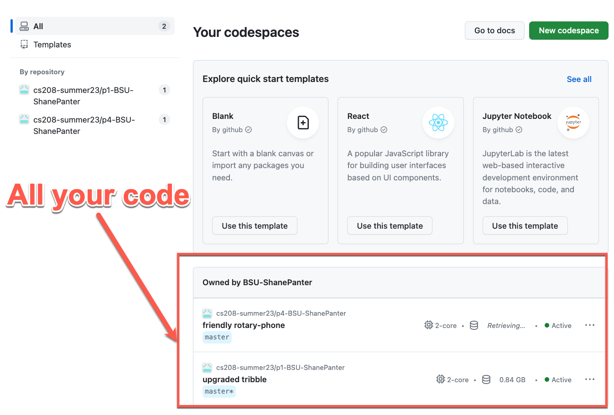

# VSCode Tips and Tricks

This document will walk you through doing development using VSCode and
introduce you to some cool tips and tricks. You can install VSCode on
your personal machine, or you can use VSCode in the cloud with [GitHub
Codespaces](https://github.com/features/codespaces).

## Install VSCode

You can install VSCode and all the required tools on your personal
(local) machine. The advantages of using a local install is it is 100%
free and you don’t need an internet connection to do your work. The
disadvantage is it can sometimes be difficult and time consuming to
install and configure all the tools correctly especially if you are
using the Windows operating system.

1. [Install Git](https://git-scm.com/downloads)
2. [Install Visual Studio Code (Java)](https://code.visualstudio.com/learntocode/)
3. Read through the [User interface tutorial](https://code.visualstudio.com/docs/getstarted/userinterface)
4. [Read Terminal Basics](https://code.visualstudio.com/docs/terminal/basics)
5. Complete all the steps in the first time configuration section of this document.

## First time configuration

Before we start using VSCode we need to set a few basic configurations.
Each section is clearly labeled with what operating system it applies
to. You need to follow these steps on both local and remote setups.

### Configure defaults

This section must be completed on ALL operating systems.

The last step before beginning to write code is to configure the user
tags that will be stored as metadata on each commit for your development
environment. To do this, open VSCode then click View in the top menu and
select Terminal. Enter the following commands in the terminal, using
your name and email address

    git config --global user.name "Your Name"
    git config --global user.email "you@example.com"

When you are first learning to use git using a rebase workflow can help
to reduce the number of conflicts that you have to deal with. Thus, we
will set it as the default method when pulling down code.

    git config --global pull.rebase true
    git config --global fetch.prune true
    git config --global diff.colorMoved zebra

Additional reading:

- [Merging vs. Rebasing](https://www.atlassian.com/git/tutorials/merging-vs-rebasing)
- [Git configurations](https://spin.atomicobject.com/2020/05/05/git-configurations-default/)

### Configure the default terminal (Windows Only)

This section only applies to Windows users who are developing locally.
If "Git Bash" is not listed as an option you need to [install
Git](https://git-scm.com/downloads) as detailed in the first section of
this document.

VSCode defaults to powershell on Windows. While powershell is a great
terminal all the scripts in my classes require Git Bash. So it is best
to set the default terminal to Git Bash so everything works correctly

1. Open Visual Studio Code
2. Press CTRL + SHIFT + P to open the Command Palette
3. Search for “Terminal: Select Default Profile”
4. Select "Git Bash"

<figure>

</figure>

## Developing Remotely

This section is optional and is provided for students who wish to
develop remotely. You are not required to develop remotely, all the
homework assignments can be done on the CS lab machines in person.

This section will walk you through using VSCode to develop remotely.
This is incredibly convenient as it allows you to connect directly to a
server to run and test your code. For advanced users you can read
through the [official
documentation](https://code.visualstudio.com/docs/remote/ssh) for more
details on how everything works.

### Connecting to a Server

- First you need to install the [Remote development extension pack](https://marketplace.visualstudio.com/items?itemName=ms-vscode-remote.vscode-remote-extensionpack)
- Open the [command pallet](https://code.visualstudio.com/docs/getstarted/userinterface#_command-palette)
- Select *Remote-SSH: Connect to Host…​* from the Command Palette (F1) and connect to *username@servername.com*
  - VSCode will save your information so when you connect again you will just select the server from the list!
- Select connect to started developing
  - **NOTE:** The first time you connect it may take some time for VSCode to
    install all the tools so be patient and don’t close or stop the process or
    it could cause your install to fail!

<figure>

</figure>

### Verify your connection

Once you are connected you can verify your status as shown below:

1. You should see SSH: onyx.boisestate.edu
2. When you run the command *hostname* in the integrated terminal you should see onyx.boisestate.edu
3. When you run the command *whoami* in the integrated terminal you should see your Boise State username.

<figure>

</figure>

### Installing remote extensions

When you are working remote VSCode does not automatically install any of
your extensions. To get all your remote extensions installed open the
[Extension
manager](https://code.visualstudio.com/docs/editor/extension-gallery)
and then select the local extensions that you wish to install on the
remote machine.

<figure>

</figure>

## Developing in the Cloud (GitHub Codespaces)

This section is not required for all classes. Please check your class syllabus
to see if developing in the cloud is required. If using codespaces is not
required in your class you can skip this section. You still need to complete all
the steps in the first time configuration section of this document after you
start your Codespace.

[GitHub Codespaces](https://github.com/features/codespaces) is a
complete VSCode development environment in the cloud. It is the quickest
and easiest way to write code on any machine that has an internet
connection and web browser. GitHub Codespaces provides a free tier (60
hours) that should be enough cover all the usage for a student working
on homework. However, you still may need to pay a small fee depending on
how much you use the service over the course of a semester.

- [Codespaces Billing](https://docs.github.com/en/billing/managing-billing-for-github-codespaces/about-billing-for-github-codespaces)
- [Codespaces Documentation](https://docs.github.com/en/codespaces)

### Starting a Codespace

Every repository will need its own Codespace. Creating a Codespace is
fairly straight forward after you have cloned your repository simply
click the **code button** and then click the **Create Codespaces** as
shown below. This will launch a Codespace that you can use to work on
your project.

<figure>

</figure>

### Configuring Codespace

When you are working remote VSCode does not automatically install any of
your extensions. To get all your remote extensions installed open the
[Extension manager](https://code.visualstudio.com/docs/editor/extension-gallery)
and then select the local extensions that you wish to install on the
remote machine. The first extension that you should install is Live
Preview as shown below.

<figure>

</figure>

### Remote Website Development

As long as you are using the [integrated
terminal](https://code.visualstudio.com/docs/editor/integrated-terminal)
in VSCode you can launch a website that you built on the server and
VSCode will automatically forward the ports for you so you can view it
locally. For simple websites that don’t need to run a web server you can
use the Live preview feature. After you have installed the VScode Live
preview extension you can start the built in web server just as you
would when developing locally.

Sometimes you will see an error when trying to view your website (shown
below). This is because there is sometimes a delay on how fast
Codespaces sets up port forwarding. If you click the "Open in Browser"
popup it should open up a new tab showing you your website.

<figure>

</figure>

### Running a Web Server

For more complicated setups like when you want to run a PHP server
server from Nodejs, you can start the server just like you normally
would and then view you website from the ports tab show below.

<figure>

</figure>

### Accessing the menu in Codespaces

For the most part using Codespaces is identical to developing remotely.
One of the biggest differences is accessing the Menu toolbar. The
screenshot below shows you how to access the toolbar in Codespaces.

<figure>

</figure>

### Accessing all my Codespaces

You can access all the Codespaces you created from your main profile
page. Click on the **Codespaces** menu option as shown below.

<figure>

</figure>

Then you should see all the Codespaces that you have created and can
use!

<figure>

</figure>

### Codespaces Set default timeout

The default idle timeout for codespaces is 30 minutes. You can quickly
burn through all your free hours if you keep this default. I recommend
that you set the default timeout to 10 minutes to preserve your free
tier time.

<figure>

</figure>

<figure>

</figure>

<figure>

</figure>

## Debugging Pointers

In the C programming language we can allocate a chunk of memory on the
heap and treat that chunk of memory as an array. If you are working on
debugging a problem and want to inspect the contents of the array using
the GUI debugger interface in VSCode you may have to tell the debugger
(with a cast) that a pointer is actually pointing to a dynamically
allocated array not a single variable. This example walks through how to
display a pointer as an array that is embedded within a struct.

More reading about C and GDB.

- [Reading C Declarations](http://unixwiz.net/techtips/reading-cdecl.html)
- [GDB Artificial Arrays](https://sourceware.org/gdb/current/onlinedocs/gdb/Arrays.html)
- [GDB to LLDB usage](http://lldb.llvm.org/use/map.html)
- [VSCode Data inspection](https://code.visualstudio.com/docs/editor/debugging#_data-inspection)

### Dynamic array of structs

Consider the struct declaration `buddy_pool` shown below. The `avail`
member is a pointer that we must dynamically allocate and want to
display in the debugger as an array. We can allocate the a `buddy_pool`
struct (in the stack or data segment) and then dynamically allocate the
`avail` array using `malloc`.

    struct avail
    {
        int tag;
        int kval;
        struct avail *next;
        struct avail *prev;
    }

    struct buddy_pool
    {
        size_t kval_m;
        uintptr_t base;
        struct avail *avail; /*pointer to the start of the avail array*/
    };

    struct buddy_pool pool;
    pool.kval = 9;
    pool.base = 0;
    pool.avail = malloc(sizeof(struct avail) * 9);

If we run the debugger we will see the variable `pool` with the element
`avail` is displayed as a single variable not an array of 9 structs as
we expected.

<figure>

</figure>

The element `avail` is just a pointer to the memory address of element
0. The debugger can’t determine the size of the array and thus will
display it as a single struct instead of an array as expected.

### Cast the array

Fortunately, all is not lost! Most debuggers allow you to set a watch on
a memory location and you can force the debugger to cast the memory to a
certain type. Both gdb and lldb have specific commands to display a
memory block as an array. However, using casting works regardless of
what debugger you are using.

If we add a new
[watch](https://code.visualstudio.com/docs/editor/debugging#_data-inspection)
on a variable and then force the debugger to display the memory block as
an array instead of a single variable we can easily inspect the data and
track down any issues you are experiencing.

    (struct avail(*) [9])pool->avail

<figure>

</figure>

### Dynamic Array

For a plain old dynamic array you can add a watch expression that is set
to to the desired type.

    *(int(*)[10])A
